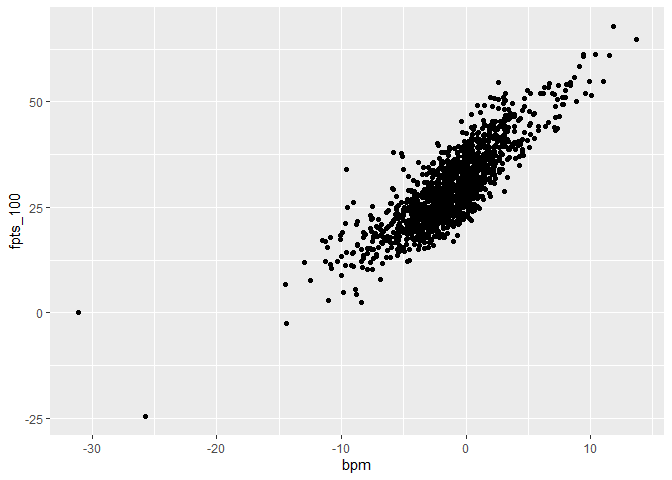
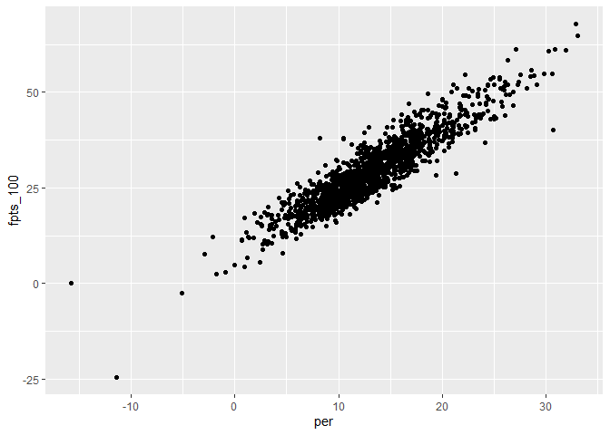

Data Visualization
================

``` r
library(tidyverse)
```

    ## -- Attaching packages ---------------------------------------------------------- tidyverse 1.3.0 --

    ## v ggplot2 3.3.2     v purrr   0.3.4
    ## v tibble  3.0.3     v dplyr   1.0.2
    ## v tidyr   1.1.2     v stringr 1.4.0
    ## v readr   1.3.1     v forcats 0.5.0

    ## -- Conflicts ------------------------------------------------------------- tidyverse_conflicts() --
    ## x dplyr::filter() masks stats::filter()
    ## x dplyr::lag()    masks stats::lag()

``` r
library(readr)

fantasy <- read_csv("data/fantasy.csv")
```

    ## Warning: Missing column names filled in: 'X1' [1]

    ## Parsed with column specification:
    ## cols(
    ##   .default = col_double(),
    ##   player = col_character(),
    ##   pos.x = col_character(),
    ##   tm.x = col_character()
    ## )

    ## See spec(...) for full column specifications.

``` r
ggplot(fantasy, aes(bpm, fpts_100)) +
  geom_point()
```

<!-- -->

``` r
cor(fantasy$bpm, fantasy$fpts_100)
```

    ## [1] 0.8361759

``` r
ggplot(fantasy, aes(per, fpts_100)) +
  geom_point()
```

<!-- -->

``` r
cor(fantasy$per, fantasy$fpts_100)
```

    ## [1] 0.9205577
