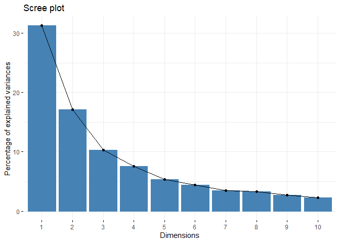
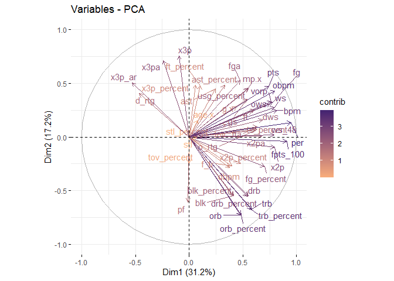
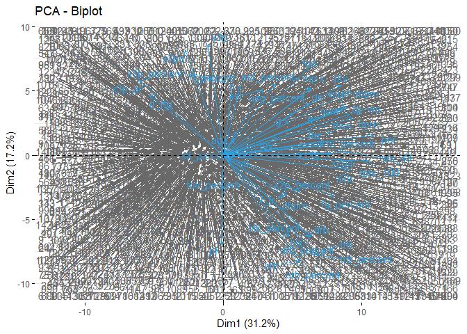
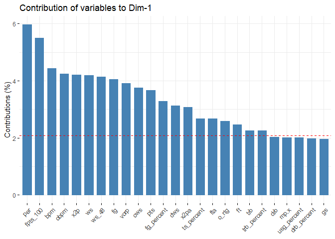
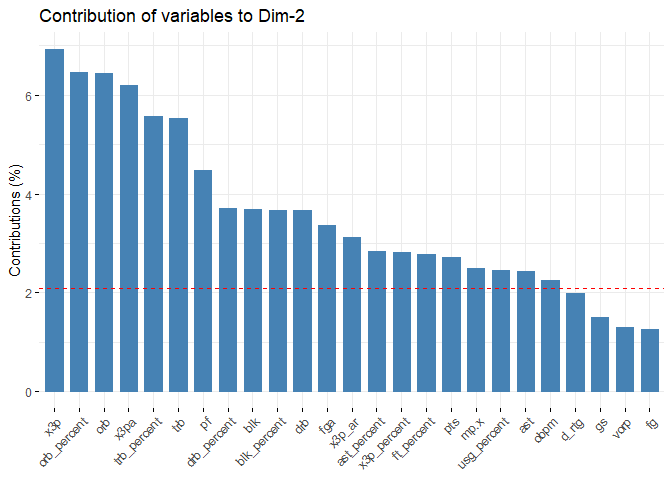
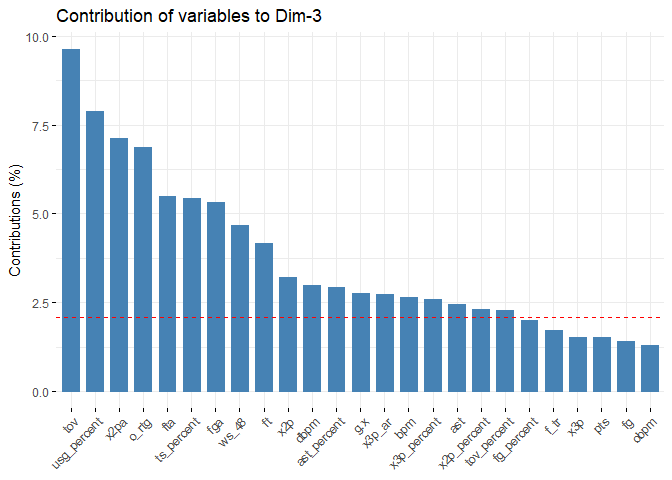
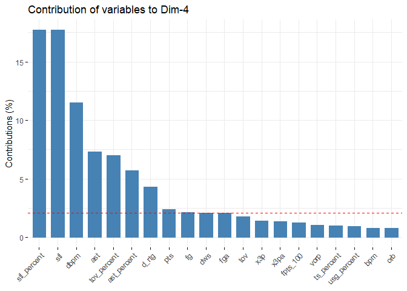

Feature Selection
================

``` r
library(tidyverse)
```

    ## -- Attaching packages ---------------------------------------------------------- tidyverse 1.3.0 --

    ## v ggplot2 3.3.2     v purrr   0.3.4
    ## v tibble  3.0.3     v dplyr   1.0.2
    ## v tidyr   1.1.2     v stringr 1.4.0
    ## v readr   1.3.1     v forcats 0.5.0

    ## -- Conflicts ------------------------------------------------------------- tidyverse_conflicts() --
    ## x dplyr::filter() masks stats::filter()
    ## x dplyr::lag()    masks stats::lag()

``` r
library(readr)
library(factoextra)
```

    ## Welcome! Want to learn more? See two factoextra-related books at https://goo.gl/ve3WBa

``` r
fantasy <- read_csv("./data/fantasy.csv", col_types = cols(X1 = col_skip()))
```

    ## Warning: Missing column names filled in: 'X1' [1]

# Delete any non-numeric variables

``` r
fantasy <- as.data.frame(fantasy)

fantasy <- fantasy %>%
  select(-player,-pos.x,-tm.x)
```

# 1\. Confirm that the data is metric

``` r
summary(fantasy)
```

    ##      age.x            g.x              gs             mp.x     
    ##  Min.   :19.00   Min.   : 1.00   Min.   : 0.00   Min.   :   4  
    ##  1st Qu.:23.00   1st Qu.:31.00   1st Qu.: 1.00   1st Qu.: 420  
    ##  Median :25.00   Median :57.00   Median :10.00   Median :1134  
    ##  Mean   :25.89   Mean   :50.22   Mean   :23.92   Mean   :1157  
    ##  3rd Qu.:29.00   3rd Qu.:70.00   3rd Qu.:48.00   3rd Qu.:1808  
    ##  Max.   :43.00   Max.   :82.00   Max.   :82.00   Max.   :3028  
    ##        fg              fga          fg_percent          x3p       
    ##  Min.   : 0.000   Min.   : 4.80   Min.   :0.0000   Min.   :0.000  
    ##  1st Qu.: 5.800   1st Qu.:13.50   1st Qu.:0.4030   1st Qu.:1.100  
    ##  Median : 7.100   Median :16.10   Median :0.4390   Median :2.100  
    ##  Mean   : 7.424   Mean   :16.73   Mean   :0.4434   Mean   :2.116  
    ##  3rd Qu.: 8.900   3rd Qu.:19.60   3rd Qu.:0.4820   3rd Qu.:3.000  
    ##  Max.   :16.300   Max.   :39.20   Max.   :0.7330   Max.   :7.400  
    ##       x3pa         x3p_percent         x2p              x2pa      
    ##  Min.   : 0.000   Min.   :0.000   Min.   : 0.000   Min.   : 1.00  
    ##  1st Qu.: 4.000   1st Qu.:0.283   1st Qu.: 3.400   1st Qu.: 7.30  
    ##  Median : 6.300   Median :0.339   Median : 4.900   Median :10.00  
    ##  Mean   : 6.252   Mean   :0.314   Mean   : 5.308   Mean   :10.48  
    ##  3rd Qu.: 8.500   3rd Qu.:0.376   3rd Qu.: 6.800   3rd Qu.:13.10  
    ##  Max.   :19.600   Max.   :1.000   Max.   :16.100   Max.   :25.30  
    ##   x2p_percent           ft              fta           ft_percent    
    ##  Min.   :0.0000   Min.   : 0.000   Min.   : 0.200   Min.   :0.0000  
    ##  1st Qu.:0.4560   1st Qu.: 1.800   1st Qu.: 2.400   1st Qu.:0.6820  
    ##  Median :0.5020   Median : 2.700   Median : 3.700   Median :0.7680  
    ##  Mean   :0.5017   Mean   : 3.116   Mean   : 4.144   Mean   :0.7461  
    ##  3rd Qu.:0.5510   3rd Qu.: 4.000   3rd Qu.: 5.300   3rd Qu.:0.8310  
    ##  Max.   :1.0000   Max.   :24.300   Max.   :24.300   Max.   :1.0000  
    ##       orb             drb              trb              ast        
    ##  Min.   :0.000   Min.   : 0.000   Min.   : 0.000   Min.   : 0.000  
    ##  1st Qu.:0.900   1st Qu.: 4.600   1st Qu.: 5.600   1st Qu.: 2.500  
    ##  Median :1.400   Median : 6.100   Median : 7.700   Median : 3.500  
    ##  Mean   :1.988   Mean   : 6.623   Mean   : 8.611   Mean   : 4.464  
    ##  3rd Qu.:2.700   3rd Qu.: 8.100   3rd Qu.:10.800   3rd Qu.: 6.000  
    ##  Max.   :8.500   Max.   :39.200   Max.   :39.200   Max.   :14.900  
    ##       stl             blk              tov               pf        
    ##  Min.   :0.000   Min.   :0.0000   Min.   : 0.000   Min.   : 0.000  
    ##  1st Qu.:1.100   1st Qu.:0.4000   1st Qu.: 1.800   1st Qu.: 3.400  
    ##  Median :1.400   Median :0.7000   Median : 2.500   Median : 4.200  
    ##  Mean   :1.533   Mean   :0.9388   Mean   : 2.634   Mean   : 4.452  
    ##  3rd Qu.:1.900   3rd Qu.:1.2000   3rd Qu.: 3.300   3rd Qu.: 5.300  
    ##  Max.   :6.100   Max.   :7.1000   Max.   :12.200   Max.   :12.400  
    ##       pts            o_rtg           d_rtg          fpts_100     
    ##  Min.   : 3.00   Min.   : 29.0   Min.   : 95.0   Min.   :-24.40  
    ##  1st Qu.:15.60   1st Qu.:102.0   1st Qu.:108.0   1st Qu.: 23.20  
    ##  Median :19.30   Median :108.0   Median :111.0   Median : 28.50  
    ##  Mean   :20.08   Mean   :107.3   Mean   :110.3   Mean   : 29.43  
    ##  3rd Qu.:24.00   3rd Qu.:115.0   3rd Qu.:113.0   3rd Qu.: 34.70  
    ##  Max.   :48.20   Max.   :165.0   Max.   :123.0   Max.   : 67.80  
    ##       per           ts_percent         x3p_ar            f_tr       
    ##  Min.   :-15.80   Min.   :0.1270   Min.   :0.0010   Min.   :0.0190  
    ##  1st Qu.:  9.90   1st Qu.:0.5070   1st Qu.:0.2580   1st Qu.:0.1610  
    ##  Median : 12.70   Median :0.5460   Median :0.3930   Median :0.2270  
    ##  Mean   : 13.22   Mean   :0.5393   Mean   :0.3788   Mean   :0.2483  
    ##  3rd Qu.: 16.20   3rd Qu.:0.5830   3rd Qu.:0.5060   3rd Qu.:0.3130  
    ##  Max.   : 33.10   Max.   :0.8310   Max.   :0.9140   Max.   :1.5000  
    ##   orb_percent      drb_percent     trb_percent      ast_percent   
    ##  Min.   : 0.000   Min.   : 0.00   Min.   : 0.000   Min.   : 0.00  
    ##  1st Qu.: 1.900   1st Qu.:10.40   1st Qu.: 6.300   1st Qu.: 7.40  
    ##  Median : 3.200   Median :13.70   Median : 8.600   Median :10.90  
    ##  Mean   : 4.462   Mean   :14.87   Mean   : 9.661   Mean   :13.74  
    ##  3rd Qu.: 6.100   3rd Qu.:18.20   3rd Qu.:12.200   3rd Qu.:18.10  
    ##  Max.   :20.200   Max.   :90.30   Max.   :44.200   Max.   :49.80  
    ##   stl_percent     blk_percent      tov_percent     usg_percent   
    ##  Min.   :0.000   Min.   : 0.000   Min.   : 0.00   Min.   : 6.40  
    ##  1st Qu.:1.100   1st Qu.: 0.700   1st Qu.: 9.70   1st Qu.:15.10  
    ##  Median :1.400   Median : 1.200   Median :12.10   Median :17.90  
    ##  Mean   :1.533   Mean   : 1.667   Mean   :12.47   Mean   :18.85  
    ##  3rd Qu.:1.900   3rd Qu.: 2.100   3rd Qu.:14.80   3rd Qu.:22.30  
    ##  Max.   :6.100   Max.   :12.200   Max.   :44.10   Max.   :47.20  
    ##       ows             dws               ws             ws_48         
    ##  Min.   :-2.80   Min.   :-0.500   Min.   :-1.700   Min.   :-0.66100  
    ##  1st Qu.: 0.00   1st Qu.: 0.300   1st Qu.: 0.300   1st Qu.: 0.04300  
    ##  Median : 0.60   Median : 0.900   Median : 1.600   Median : 0.08300  
    ##  Mean   : 1.23   Mean   : 1.162   Mean   : 2.392   Mean   : 0.07959  
    ##  3rd Qu.: 2.00   3rd Qu.: 1.700   3rd Qu.: 3.600   3rd Qu.: 0.12000  
    ##  Max.   :11.60   Max.   : 5.900   Max.   :15.400   Max.   : 0.45000  
    ##       obpm              dbpm               bpm               vorp        
    ##  Min.   :-24.700   Min.   :-11.2000   Min.   :-31.100   Min.   :-2.0000  
    ##  1st Qu.: -2.800   1st Qu.: -1.0000   1st Qu.: -3.100   1st Qu.:-0.1000  
    ##  Median : -1.100   Median : -0.2000   Median : -1.200   Median : 0.1000  
    ##  Mean   : -1.142   Mean   : -0.1405   Mean   : -1.283   Mean   : 0.5789  
    ##  3rd Qu.:  0.500   3rd Qu.:  0.7000   3rd Qu.:  0.600   3rd Qu.: 0.9000  
    ##  Max.   :  9.400   Max.   :  5.3000   Max.   : 13.700   Max.   : 9.3000

All of the data has numerical meaning (1 is less than 2 which is less
than 3 etc.)

# 2\. Scale the data

The columns of my data set do have the same range. Thus, columns with
larger maximums or smaller minimums could affect the analysis.
Therefore, I will scale the data so all of the columns range from 0 to 1
with a standard deviation of
1.

``` r
fantasy_scaled = apply(fantasy,2, function(r) {if (sd(r)!=0) res=(r-mean(r))/sd(r) else res=0*r; res})

summary(fantasy_scaled)
```

    ##      age.x              g.x                gs               mp.x        
    ##  Min.   :-1.6515   Min.   :-2.0820   Min.   :-0.8781   Min.   :-1.4623  
    ##  1st Qu.:-0.6923   1st Qu.:-0.8130   1st Qu.:-0.8414   1st Qu.:-0.9349  
    ##  Median :-0.2127   Median : 0.2867   Median :-0.5111   Median :-0.0297  
    ##  Mean   : 0.0000   Mean   : 0.0000   Mean   : 0.0000   Mean   : 0.0000  
    ##  3rd Qu.: 0.7465   3rd Qu.: 0.8366   3rd Qu.: 0.8837   3rd Qu.: 0.8248  
    ##  Max.   : 4.1037   Max.   : 1.3442   Max.   : 2.1317   Max.   : 2.3716  
    ##        fg               fga            fg_percent            x3p          
    ##  Min.   :-3.0452   Min.   :-2.5447   Min.   :-5.53057   Min.   :-1.54558  
    ##  1st Qu.:-0.6660   1st Qu.:-0.6890   1st Qu.:-0.50387   1st Qu.:-0.74208  
    ##  Median :-0.1327   Median :-0.1345   Median :-0.05483   Median :-0.01164  
    ##  Mean   : 0.0000   Mean   : 0.0000   Mean   : 0.00000   Mean   : 0.00000  
    ##  3rd Qu.: 0.6057   3rd Qu.: 0.6121   3rd Qu.: 0.48152   3rd Qu.: 0.64577  
    ##  Max.   : 3.6413   Max.   : 4.7928   Max.   : 3.61230   Max.   : 3.85974  
    ##       x3pa           x3p_percent           x2p               x2pa        
    ##  Min.   :-1.83377   Min.   :-2.5337   Min.   :-2.0762   Min.   :-2.1111  
    ##  1st Qu.:-0.66048   1st Qu.:-0.2503   1st Qu.:-0.7464   1st Qu.:-0.7078  
    ##  Median : 0.01416   Median : 0.2016   Median :-0.1597   Median :-0.1064  
    ##  Mean   : 0.00000   Mean   : 0.0000   Mean   : 0.0000   Mean   : 0.0000  
    ##  3rd Qu.: 0.65947   3rd Qu.: 0.5001   3rd Qu.: 0.5834   3rd Qu.: 0.5840  
    ##  Max.   : 3.91536   Max.   : 5.5350   Max.   : 4.2207   Max.   : 3.3014  
    ##   x2p_percent              ft               fta            ft_percent     
    ##  Min.   :-5.373208   Min.   :-1.5897   Min.   :-1.6616   Min.   :-5.5075  
    ##  1st Qu.:-0.489266   1st Qu.:-0.6713   1st Qu.:-0.7348   1st Qu.:-0.4732  
    ##  Median : 0.003412   Median :-0.2122   Median :-0.1871   Median : 0.1616  
    ##  Mean   : 0.000000   Mean   : 0.0000   Mean   : 0.0000   Mean   : 0.0000  
    ##  3rd Qu.: 0.528222   3rd Qu.: 0.4511   3rd Qu.: 0.4870   3rd Qu.: 0.6266  
    ##  Max.   : 5.337191   Max.   :10.8081   Max.   : 8.4915   Max.   : 1.8741  
    ##       orb               drb               trb               ast         
    ##  Min.   :-1.2515   Min.   :-2.2485   Min.   :-2.0943   Min.   :-1.6424  
    ##  1st Qu.:-0.6849   1st Qu.:-0.6868   1st Qu.:-0.7323   1st Qu.:-0.7227  
    ##  Median :-0.3702   Median :-0.1775   Median :-0.2215   Median :-0.3548  
    ##  Mean   : 0.0000   Mean   : 0.0000   Mean   : 0.0000   Mean   : 0.0000  
    ##  3rd Qu.: 0.4482   3rd Qu.: 0.5015   3rd Qu.: 0.5325   3rd Qu.: 0.5650  
    ##  Max.   : 4.0996   Max.   :11.0601   Max.   : 7.4401   Max.   : 3.8392  
    ##       stl               blk               tov                pf         
    ##  Min.   :-2.1033   Min.   :-1.0856   Min.   :-2.2227   Min.   :-2.8233  
    ##  1st Qu.:-0.5944   1st Qu.:-0.6230   1st Qu.:-0.7039   1st Qu.:-0.6672  
    ##  Median :-0.1829   Median :-0.2761   Median :-0.1133   Median :-0.1599  
    ##  Mean   : 0.0000   Mean   : 0.0000   Mean   : 0.0000   Mean   : 0.0000  
    ##  3rd Qu.: 0.5030   3rd Qu.: 0.3020   3rd Qu.: 0.5617   3rd Qu.: 0.5376  
    ##  Max.   : 6.2643   Max.   : 7.1244   Max.   : 8.0713   Max.   : 5.0399  
    ##       pts              o_rtg              d_rtg            fpts_100      
    ##  Min.   :-2.6049   Min.   :-6.42145   Min.   :-3.8508   Min.   :-5.8496  
    ##  1st Qu.:-0.6829   1st Qu.:-0.43114   1st Qu.:-0.5824   1st Qu.:-0.6769  
    ##  Median :-0.1184   Median : 0.06121   Median : 0.1718   Median :-0.1009  
    ##  Mean   : 0.0000   Mean   : 0.00000   Mean   : 0.0000   Mean   : 0.0000  
    ##  3rd Qu.: 0.5985   3rd Qu.: 0.63563   3rd Qu.: 0.6747   3rd Qu.: 0.5729  
    ##  Max.   : 4.2901   Max.   : 4.73858   Max.   : 3.1888   Max.   : 4.1698  
    ##       per             ts_percent           x3p_ar              f_tr        
    ##  Min.   :-5.47568   Min.   :-5.73382   Min.   :-1.95378   Min.   :-1.8057  
    ##  1st Qu.:-0.62567   1st Qu.:-0.44959   1st Qu.:-0.62482   1st Qu.:-0.6875  
    ##  Median :-0.09726   Median : 0.09273   Median : 0.07328   Median :-0.1678  
    ##  Mean   : 0.00000   Mean   : 0.00000   Mean   : 0.00000   Mean   : 0.0000  
    ##  3rd Qu.: 0.56325   3rd Qu.: 0.60725   3rd Qu.: 0.65761   3rd Qu.: 0.5095  
    ##  Max.   : 3.75256   Max.   : 4.05591   Max.   : 2.76741   Max.   : 9.8570  
    ##   orb_percent       drb_percent       trb_percent       ast_percent     
    ##  Min.   :-1.2506   Min.   :-2.2574   Min.   :-2.0999   Min.   :-1.5643  
    ##  1st Qu.:-0.7181   1st Qu.:-0.6783   1st Qu.:-0.7305   1st Qu.:-0.7217  
    ##  Median :-0.3538   Median :-0.1772   Median :-0.2306   Median :-0.3232  
    ##  Mean   : 0.0000   Mean   : 0.0000   Mean   : 0.0000   Mean   : 0.0000  
    ##  3rd Qu.: 0.4590   3rd Qu.: 0.5060   3rd Qu.: 0.5519   3rd Qu.: 0.4966  
    ##  Max.   : 4.4109   Max.   :11.4533   Max.   : 7.5075   Max.   : 4.1061  
    ##   stl_percent       blk_percent       tov_percent        usg_percent     
    ##  Min.   :-2.1043   Min.   :-1.0860   Min.   :-2.80523   Min.   :-2.3280  
    ##  1st Qu.:-0.5948   1st Qu.:-0.6301   1st Qu.:-0.62347   1st Qu.:-0.7018  
    ##  Median :-0.1832   Median :-0.3044   Median :-0.08366   Median :-0.1784  
    ##  Mean   : 0.0000   Mean   : 0.0000   Mean   : 0.00000   Mean   : 0.0000  
    ##  3rd Qu.: 0.5030   3rd Qu.: 0.2818   3rd Qu.: 0.52364   3rd Qu.: 0.6440  
    ##  Max.   : 6.2664   Max.   : 6.8603   Max.   : 7.11388   Max.   : 5.2983  
    ##       ows               dws                ws              ws_48         
    ##  Min.   :-2.2294   Min.   :-1.6118   Min.   :-1.5740   Min.   :-9.98369  
    ##  1st Qu.:-0.6804   1st Qu.:-0.8359   1st Qu.:-0.8047   1st Qu.:-0.49331  
    ##  Median :-0.3484   Median :-0.2539   Median :-0.3047   Median : 0.04592  
    ##  Mean   : 0.0000   Mean   : 0.0000   Mean   : 0.0000   Mean   : 0.00000  
    ##  3rd Qu.: 0.4261   3rd Qu.: 0.5220   3rd Qu.: 0.4646   3rd Qu.: 0.54470  
    ##  Max.   : 5.7370   Max.   : 4.5956   Max.   : 5.0033   Max.   : 4.99332  
    ##       obpm               dbpm               bpm                vorp        
    ##  Min.   :-7.94885   Min.   :-8.08127   Min.   :-8.44773   Min.   :-2.0797  
    ##  1st Qu.:-0.55956   1st Qu.:-0.62805   1st Qu.:-0.51475   1st Qu.:-0.5475  
    ##  Median : 0.01404   Median :-0.04348   Median : 0.02356   Median :-0.3862  
    ##  Mean   : 0.00000   Mean   : 0.00000   Mean   : 0.00000   Mean   : 0.0000  
    ##  3rd Qu.: 0.55390   3rd Qu.: 0.61415   3rd Qu.: 0.53354   3rd Qu.: 0.2589  
    ##  Max.   : 3.55685   Max.   : 3.97541   Max.   : 4.24504   Max.   : 7.0326

# 3\. Check correlations

I need large correlations (\>0.5) because the grouping that I am doing
groups raw attributes that are highly correlated. Thus, I will use the
correlation matrix to observe the correlation between variables.

``` r
thecor = round(cor(fantasy),2)
colnames(thecor)<-colnames(fantasy)
rownames(thecor)<-colnames(fantasy)
cor_frame <- round(thecor,2)
```

There are a decent number of variables that are moderately correlated
with fantasy points and few that have a strong positive correlation with
fantasy points such as PER and BPM. Maybe these can be grouped together.

# 4\. Choose number of components

I use PCA to generate derived variables from the raw data. Thus, I can
capture most of the data in just a few factors.

``` r
# conduct PCA analysis with prcomp function
# creats PCA output object
pca_out = prcomp(fantasy, scale = TRUE)

# now that we have checked that
# we can dive into the PCA results a bit more
# this "get_pca_var" gives us the PCA information for the variables in our data
res_var = get_pca_var(pca_out)

# look at PCA coordinates 
res_var$coord
```

    ##                    Dim.1        Dim.2        Dim.3        Dim.4       Dim.5
    ## age.x        0.079783228  0.157370972  0.199988455 -0.070312042  0.07038809
    ## g.x          0.440687301  0.282265162  0.369113623 -0.101671406  0.29485007
    ## gs           0.541063976  0.350743158  0.123364760 -0.122857429  0.35226332
    ## mp.x         0.549877007  0.453874229  0.232239809 -0.123978259  0.34522602
    ## fg           0.779845331  0.323036148 -0.263788392  0.277685110 -0.07248902
    ## fga          0.476232774  0.526197117 -0.513347698  0.276399134  0.15791610
    ## fg_percent   0.701939286 -0.277208516  0.315830753  0.108839421 -0.40597038
    ## x3p         -0.094893492  0.755033781  0.275300025  0.226865156  0.19463348
    ## x3pa        -0.238631173  0.714347209  0.075482354  0.220093024  0.31374241
    ## x3p_percent  0.058940839  0.481701610  0.358014707  0.119990754 -0.03360734
    ## x2p          0.794406796 -0.096459294 -0.398962732  0.143076894 -0.17222896
    ## x2pa         0.678405514  0.007344821 -0.593662292  0.121422357 -0.07381305
    ## x2p_percent  0.480787858 -0.247847778  0.339002549  0.108791988 -0.32287065
    ## ft           0.607345710  0.254284105 -0.454750247  0.139851297 -0.09663159
    ## fta          0.633465658  0.098337584 -0.521306283  0.130132454 -0.07498856
    ## ft_percent   0.104804526  0.478056733  0.117923059  0.098832190 -0.05132690
    ## orb          0.480135381 -0.728450725 -0.006624045  0.169011331 -0.01954869
    ## drb          0.551337781 -0.550081388 -0.053631713  0.142128172  0.41656886
    ## trb          0.580492562 -0.675468957 -0.041422222  0.167163428  0.29120142
    ## ast          0.245655498  0.448321549 -0.348326063 -0.514155503 -0.21747980
    ## stl          0.071524605 -0.005510896 -0.072706064 -0.801366534 -0.07029346
    ## blk          0.411508968 -0.550639375  0.120614590  0.005374625  0.16008635
    ## tov          0.340104979  0.116401351 -0.689826987 -0.252887276  0.05515192
    ## pf          -0.010680282 -0.606897811 -0.071270904  0.022378494 -0.08986802
    ## pts          0.741880932  0.473803881 -0.274126489  0.295258795 -0.04197220
    ## o_rtg        0.623813373  0.062843590  0.583163003  0.153178137 -0.41183745
    ## d_rtg       -0.463448480  0.404738923 -0.086053334  0.395438405 -0.32986161
    ## fpts_100     0.908319652 -0.039660174  0.004111173 -0.213556737 -0.11494889
    ## per          0.946030021  0.133662996  0.073919220  0.039374588 -0.19217301
    ## ts_percent   0.634185481  0.075258764  0.518557201  0.189368218 -0.36945855
    ## x3p_ar      -0.529939571  0.506558064  0.367810462  0.081062200  0.27613395
    ## f_tr         0.399969402 -0.270551843 -0.290783596 -0.011895183 -0.22754279
    ## orb_percent  0.482588092 -0.729538135 -0.004369572  0.165842238 -0.02114997
    ## drb_percent  0.543327290 -0.552866942 -0.062242272  0.148496967  0.41191145
    ## trb_percent  0.580473789 -0.677623294 -0.041645158  0.167526983  0.28612297
    ## ast_percent  0.329890828  0.483600481 -0.381538604 -0.454610388 -0.21100531
    ## stl_percent  0.071345094 -0.005248742 -0.072433666 -0.801519523 -0.07081346
    ## blk_percent  0.409427911 -0.550369433  0.121647124  0.007709673  0.15408665
    ## tov_percent -0.001011119 -0.243793599 -0.336368323 -0.503815704 -0.06161624
    ## usg_percent  0.549418300  0.450111708 -0.624878921  0.186630645  0.12076006
    ## ows          0.751185454  0.308669493  0.199547020 -0.034472160  0.11397574
    ## dws          0.684157234  0.161115921  0.225202901 -0.276464483  0.44472309
    ## ws           0.793285549  0.278040988  0.227470444 -0.134329973  0.25518404
    ## ws_48        0.788685518  0.018842713  0.481316366 -0.017023113 -0.26625734
    ## obpm         0.797593751  0.430663548  0.254386600  0.094901922 -0.15377305
    ## dbpm         0.377885035 -0.286505278  0.383815930 -0.645455447  0.01988260
    ## bpm          0.816047348  0.251141654  0.362616806 -0.170847259 -0.12182600
    ## vorp         0.765826213  0.328401177  0.059840126 -0.194345385  0.22669781
    ##                    Dim.6        Dim.7        Dim.8       Dim.9       Dim.10
    ## age.x       -0.011346328  0.199254033 -0.254827086  0.18006046 -0.364036682
    ## g.x         -0.460203855 -0.166170533 -0.058962386 -0.12942659  0.083008159
    ## gs          -0.380265050 -0.139984201  0.029095315 -0.09205960  0.066142230
    ## mp.x        -0.443588387 -0.154843595  0.003819693 -0.09493157  0.091134405
    ## fg           0.177145442 -0.282727127 -0.011470785 -0.06698019  0.053122947
    ## fga          0.253771268 -0.218518223  0.054571644 -0.04376781 -0.009248981
    ## fg_percent  -0.071110363 -0.192526040 -0.159284023 -0.08164785  0.193609177
    ## x3p          0.390340940  0.127852156 -0.094516411 -0.04532347  0.136635963
    ## x3pa         0.403697933  0.145778998 -0.043143493 -0.02458337  0.134524674
    ## x3p_percent  0.227949513  0.010632307 -0.211517050 -0.09223821  0.135266042
    ## x2p         -0.039621097 -0.338099635  0.040261132 -0.04018242 -0.021649292
    ## x2pa        -0.041280759 -0.338466426  0.089642966 -0.02726300 -0.111642608
    ## x2p_percent -0.026980670 -0.135241104 -0.170508117 -0.08799837  0.293323048
    ## ft          -0.077968626  0.455600529  0.263725127 -0.04924994  0.038825165
    ## fta         -0.076210243  0.400923651  0.268450194 -0.02851563  0.099071168
    ## ft_percent  -0.025742075  0.250970191  0.029853908 -0.02921816 -0.178490828
    ## orb         -0.062250435  0.002579808  0.040520541  0.13480809 -0.008097784
    ## drb          0.166885699  0.057073163 -0.190744172  0.25677564  0.056676115
    ## trb          0.096065288  0.041980547 -0.120572381  0.23590490  0.037492769
    ## ast         -0.028998964  0.043980549 -0.377840641  0.13324605 -0.256026675
    ## stl          0.292407008 -0.134084489  0.334888463  0.09232296  0.212278867
    ## blk          0.183592579  0.082077709  0.021887240 -0.57405164 -0.283804599
    ## tov         -0.025626773  0.155280525 -0.411913624 -0.17327817  0.239409498
    ## pf           0.152743600  0.137120198 -0.134372632 -0.26535753  0.174218810
    ## pts          0.189495071 -0.047508134  0.050300531 -0.07408193  0.080111843
    ## o_rtg       -0.008669929  0.091011740 -0.014432486  0.10793358 -0.017896553
    ## d_rtg       -0.312525495 -0.003531171 -0.093578229  0.03903461 -0.019269724
    ## fpts_100     0.209326740 -0.007772156 -0.093303995  0.03749293 -0.167163055
    ## per          0.142356443 -0.019022398  0.022980817  0.04312029 -0.058177108
    ## ts_percent   0.017364911  0.088384279 -0.152423024 -0.09188150  0.254035165
    ## x3p_ar       0.284422493  0.252910734 -0.068015203  0.01443426  0.121458551
    ## f_tr        -0.248805506  0.594390013  0.310632164  0.01105598  0.122925715
    ## orb_percent -0.058569912  0.004110856  0.039597738  0.13015274 -0.007601544
    ## drb_percent  0.162776585  0.053206360 -0.189829238  0.25675889  0.063146042
    ## trb_percent  0.094666897  0.041804191 -0.121916645  0.23278814  0.040215166
    ## ast_percent  0.001683885  0.030048667 -0.351113832  0.12059835 -0.230104718
    ## stl_percent  0.292182622 -0.133744043  0.334823412  0.09234166  0.212580277
    ## blk_percent  0.191553930  0.084216386  0.020627717 -0.57216485 -0.285692757
    ## tov_percent -0.173945618  0.232002088 -0.551664773 -0.18136574  0.251269231
    ## usg_percent  0.181962920 -0.069325426  0.007088756 -0.07407960  0.055151857
    ## ows         -0.249473016  0.152795213  0.085529896  0.07473751 -0.019861522
    ## dws         -0.232993069 -0.059002316  0.058275396 -0.08483278  0.047042709
    ## ws          -0.265417932  0.083365031  0.081979397  0.01833749  0.004717985
    ## ws_48        0.102985757  0.089129792  0.052345193  0.07656839 -0.074801813
    ## obpm         0.113695379  0.018495703 -0.023218878  0.09373874 -0.079637797
    ## dbpm         0.277467233  0.027238334  0.086795020 -0.07405917 -0.037082320
    ## bpm          0.202564134  0.026117093  0.013919689  0.04957897 -0.081530474
    ## vorp        -0.035606911  0.157061336  0.067842139  0.06125655 -0.038746882
    ##                  Dim.11       Dim.12        Dim.13        Dim.14        Dim.15
    ## age.x        0.53799075 -0.547248117  0.1689471677 -0.1403479328  0.0990437667
    ## g.x         -0.10116128 -0.161046244  0.0230740452 -0.0287714188 -0.0656023044
    ## gs          -0.05179845  0.018778903 -0.0150259151 -0.0773423311  0.0380632272
    ## mp.x        -0.06555080 -0.069942654  0.0102330192 -0.0465195112  0.0001818084
    ## fg           0.07474539 -0.045094542 -0.0030864026 -0.0070741305 -0.0242853448
    ## fga          0.05517461 -0.041601246 -0.0351118777 -0.0289471129 -0.0325434393
    ## fg_percent   0.07651428 -0.043918812  0.0501709145  0.0504027196  0.0342588790
    ## x3p         -0.02124667  0.022060803 -0.0316834301 -0.1364251885  0.0342092192
    ## x3pa         0.12308176  0.070449784 -0.1621556025 -0.0415205442  0.0135491065
    ## x3p_percent -0.35235995 -0.082412326  0.4789239135 -0.1642675100  0.0606942914
    ## x2p          0.08250843 -0.054321480  0.0145089154  0.0663517039 -0.0411918233
    ## x2pa        -0.03604703 -0.096349931  0.0863072046  0.0010200682 -0.0436513522
    ## x2p_percent  0.36495369  0.073736760 -0.1922692972  0.2665519257  0.0121175760
    ## ft          -0.04227182 -0.068565277  0.0297807769  0.0711908632 -0.0005068185
    ## fta          0.04649546  0.024208205  0.1334344810  0.0293808657  0.0049741173
    ## ft_percent  -0.37798156 -0.473040689 -0.3974511312  0.2494437933 -0.1445777174
    ## orb         -0.08662725 -0.016773852 -0.2015134806 -0.2979186357  0.1198343071
    ## drb         -0.06426726 -0.008675559  0.0848178797  0.1626270186 -0.0392182419
    ## trb         -0.07908079 -0.012633672 -0.0170396822  0.0016626224  0.0180655580
    ## ast         -0.06461256  0.188990100 -0.0186311720 -0.0284172680 -0.0981822804
    ## stl         -0.01656582 -0.161836289 -0.0624564675 -0.0974154962  0.1031090277
    ## blk         -0.01265769  0.053159887 -0.0207948562  0.0009614384  0.1378589516
    ## tov         -0.01666360 -0.065785178 -0.0558416148 -0.0026180857  0.1120450114
    ## pf           0.07894564 -0.084002700 -0.0441036010 -0.3618735602 -0.5404737399
    ## pts          0.03900884 -0.049974578 -0.0001069143 -0.0126261369 -0.0105924723
    ## o_rtg       -0.06313898  0.016650938  0.0014470049 -0.0385166878 -0.0544647772
    ## d_rtg       -0.07673217  0.035117169 -0.0878623248 -0.1598123628  0.1260773642
    ## fpts_100    -0.07823397  0.052274238 -0.0360230463 -0.0267875963 -0.0142103301
    ## per         -0.04893812  0.008309951 -0.0317730089 -0.0306985261  0.0546369731
    ## ts_percent  -0.01684769 -0.099882598  0.0342319191  0.0509944538  0.0349725259
    ## x3p_ar       0.08595799  0.094450301 -0.1315821784 -0.0085813140  0.0214082921
    ## f_tr         0.03077402  0.027439506  0.1817697675  0.0296719144  0.0108010290
    ## orb_percent -0.08252498 -0.015474685 -0.2017303861 -0.2968851206  0.1181871565
    ## drb_percent -0.06897442 -0.015121922  0.0782967195  0.1529907858 -0.0268764222
    ## trb_percent -0.07727037 -0.014566271 -0.0212103009 -0.0019645826  0.0234784837
    ## ast_percent -0.04558431  0.185954629 -0.0198881233 -0.0285209214 -0.0890456646
    ## stl_percent -0.01669632 -0.161616572 -0.0622748213 -0.0974862921  0.1028042500
    ## blk_percent -0.01318104  0.053261723 -0.0238608366 -0.0012811369  0.1381325970
    ## tov_percent -0.04980891 -0.069431537 -0.0879770459  0.0088687530  0.1630715203
    ## usg_percent  0.04901507 -0.043060763 -0.0139849252 -0.0144941582 -0.0034099164
    ## ows          0.13426332  0.142623862 -0.0954946003 -0.1080258761 -0.0162955609
    ## dws          0.01909371 -0.004708708  0.0525028587  0.0364686884 -0.0887761496
    ## ws           0.10044006  0.098425721 -0.0463555568 -0.0603408538 -0.0458324722
    ## ws_48       -0.03329976  0.037747716 -0.0027987974 -0.0224372246 -0.0814533301
    ## obpm        -0.06013247  0.055770270 -0.0288722519 -0.0336005245  0.1270421089
    ## dbpm         0.01299103  0.007171970  0.0923017585  0.1506394703 -0.1417282916
    ## bpm         -0.04542391  0.049413158  0.0112048417  0.0303474583  0.0523093321
    ## vorp         0.14666953  0.200095542 -0.0566310074 -0.0359532936 -0.0090500390
    ##                   Dim.16        Dim.17        Dim.18       Dim.19        Dim.20
    ## age.x       -0.019529410  0.0223388304 -0.0339685700  0.013361514 -0.0062076432
    ## g.x         -0.280094981 -0.1551110770  0.2522331174  0.032557867 -0.0353074331
    ## gs          -0.039958271  0.2527211360 -0.4054909736 -0.031569879  0.0241112725
    ## mp.x        -0.172991013  0.0239165738  0.0150796946  0.014979498 -0.0240175810
    ## fg           0.017328113 -0.0143647342 -0.0010521559 -0.039787784 -0.0252366224
    ## fga         -0.019276178 -0.0268767046  0.0029951046  0.015496496  0.0214287272
    ## fg_percent   0.031222322  0.0136807473  0.0175164094 -0.086873191  0.0892387019
    ## x3p         -0.068414756 -0.0557417380 -0.0079856850 -0.119910914  0.0426880951
    ## x3pa        -0.109282747 -0.0266688377 -0.0033089132  0.035957693  0.0454824938
    ## x3p_percent  0.218847344  0.0500311498  0.0079585646  0.231683810 -0.0289679681
    ## x2p          0.053457106  0.0163187698  0.0035623396  0.026274663 -0.0470882047
    ## x2pa         0.062901200 -0.0078677168  0.0054147550 -0.011236428 -0.0115981137
    ## x2p_percent -0.041644262  0.0663985323 -0.0294681669  0.268278961 -0.0478079885
    ## ft          -0.024709023  0.0006036635 -0.0118598077  0.051363861 -0.0498739315
    ## fta         -0.080856111 -0.0125366611 -0.0084674752  0.047991805 -0.0248348748
    ## ft_percent   0.141512926  0.0534039973 -0.0157342959  0.048524891  0.0153186814
    ## orb          0.011688077 -0.1467036973 -0.0590305131  0.077345208 -0.0269451534
    ## drb         -0.049915362  0.1207135486  0.0445727009 -0.026479054  0.0105831701
    ## trb         -0.031748772  0.0296787325  0.0092492182  0.010997439 -0.0031501684
    ## ast         -0.110396042  0.0016117529 -0.0066557864  0.077248780  0.0746393248
    ## stl         -0.042098318  0.1183714980  0.0613281752  0.025306654  0.0442375104
    ## blk         -0.044673772  0.0755176303  0.0492332950  0.018105331  0.0400370480
    ## tov          0.058551018 -0.0687111927  0.0003450376 -0.023327718  0.0103790460
    ## pf          -0.023660993  0.1157523905 -0.0007733255 -0.020847899 -0.0435540314
    ## pts         -0.009021468 -0.0221538738 -0.0057898308 -0.039530807 -0.0251752662
    ## o_rtg       -0.080463708  0.0099509793 -0.0148875607 -0.001074522  0.1233682704
    ## d_rtg       -0.129002146  0.3315632170  0.1131814203 -0.032921936 -0.1550019778
    ## fpts_100    -0.093507391  0.0788026137  0.0222963159  0.019642212  0.0220607269
    ## per         -0.041635783  0.0039340212 -0.0018490323 -0.017678871 -0.0205642310
    ## ts_percent   0.008451571  0.0145473961  0.0022654133 -0.102699447  0.0997082669
    ## x3p_ar      -0.071703315 -0.0024720748 -0.0311896770  0.087679153 -0.0607293171
    ## f_tr        -0.156439669 -0.0056466984 -0.0268897222 -0.001129262  0.0457665778
    ## orb_percent  0.016925527 -0.1506080901 -0.0575148710  0.078535276 -0.0216956253
    ## drb_percent -0.062675912  0.1536891420  0.0553938819 -0.026078419  0.0123591804
    ## trb_percent -0.031639108  0.0420997065  0.0138927184  0.011301221  0.0003654377
    ## ast_percent -0.106108304  0.0041822486 -0.0103448408  0.068619759  0.0452110436
    ## stl_percent -0.042024012  0.1185778559  0.0610933375  0.025643567  0.0442291891
    ## blk_percent -0.048538236  0.0830355761  0.0413040682  0.022216119  0.0380500046
    ## tov_percent  0.106496350 -0.0652284469 -0.0088295196 -0.098697949 -0.0710665232
    ## usg_percent -0.014011915 -0.0380740521 -0.0002822987  0.015085712  0.0184524597
    ## ows          0.252191760  0.1165170987  0.1704392943 -0.012879278  0.0448181778
    ## dws          0.013929369 -0.1644932978 -0.0832153536  0.041454611  0.0288641313
    ## ws           0.181081824  0.0158958767  0.0847996134  0.007246322  0.0427995025
    ## ws_48        0.007272449 -0.1061248592 -0.0587642143 -0.027506214 -0.0136701892
    ## obpm        -0.049665641 -0.0337108637 -0.0084286645 -0.061716538 -0.0876226469
    ## dbpm        -0.002028097 -0.0437254566 -0.0563230700 -0.052659731 -0.1888964079
    ## bpm         -0.043178226 -0.0452454397 -0.0290383078 -0.072305665 -0.1468808630
    ## vorp         0.264823147  0.0636381733  0.0741291498 -0.023431053 -0.0533956606
    ##                    Dim.21        Dim.22        Dim.23        Dim.24
    ## age.x        0.0040684518 -3.151326e-03 -0.0023306174  1.996811e-03
    ## g.x         -0.0785313407 -1.632566e-02 -0.0140755277  2.019977e-02
    ## gs          -0.0805347758 -1.599240e-02 -0.0086507355  1.273850e-02
    ## mp.x        -0.0127754530  1.716507e-02  0.0014190450 -1.522114e-02
    ## fg          -0.0022828294  4.743230e-02  0.0030328918 -5.145585e-02
    ## fga         -0.0061370917  1.546591e-02 -0.0414924154  1.175190e-02
    ## fg_percent   0.0209090755 -1.039057e-02 -0.0355293995  3.106348e-02
    ## x3p         -0.0026024263  5.778779e-02  0.0043561970  5.653003e-02
    ## x3pa        -0.0100189668  2.316638e-02 -0.0517021023  2.410696e-02
    ## x3p_percent -0.0132487525  2.773909e-02 -0.0110182889  4.655819e-03
    ## x2p         -0.0002317588  1.373533e-02  0.0008783055 -7.937436e-02
    ## x2pa         0.0017172201 -1.798504e-03 -0.0043232214 -5.970208e-03
    ## x2p_percent -0.0153861323  4.150101e-02  0.0118659386  5.344035e-02
    ## ft          -0.0018148938 -1.241614e-01  0.0560101116  5.528525e-02
    ## fta         -0.0030171036 -7.699863e-02  0.0137497916  1.569020e-02
    ## ft_percent   0.0071472873  4.704337e-02 -0.0255293841  1.153544e-03
    ## orb          0.0025262962 -3.168901e-03 -0.0401532590  5.289976e-05
    ## drb          0.0008778966 -2.757277e-03  0.0101745850  2.039578e-04
    ## trb          0.0014429149 -3.300645e-03 -0.0082209120  4.943738e-04
    ## ast          0.0028170560 -7.686947e-05 -0.0101784409  2.543282e-03
    ## stl          0.0152543122 -2.635452e-03  0.0148464609  1.593908e-03
    ## blk          0.0027427395 -5.376408e-04  0.0017074002 -2.737925e-03
    ## tov          0.0051023707 -6.274889e-02 -0.0501346742 -2.689311e-02
    ## pf           0.0083931334  4.260134e-03  0.0281040349  1.492345e-02
    ## pts         -0.0021572269  9.717233e-03  0.0193496083 -1.048193e-02
    ## o_rtg        0.0345807842 -8.462528e-02 -0.0650609681 -2.438255e-02
    ## d_rtg        0.1258659660  3.298267e-03 -0.0279243201 -7.944184e-03
    ## fpts_100     0.0067700995  1.888874e-02  0.0513478957 -1.109968e-02
    ## per         -0.0058444169  2.400993e-02  0.0588853355 -1.957578e-02
    ## ts_percent   0.0360360392 -5.740507e-02 -0.0252379615 -3.280675e-02
    ## x3p_ar       0.0087547617 -5.318932e-02  0.0308626049 -1.427569e-01
    ## f_tr        -0.0076927252  1.838778e-01 -0.0598762751 -4.460383e-02
    ## orb_percent -0.0012529702 -3.715663e-03 -0.0360020744  6.111559e-04
    ## drb_percent  0.0091632874  2.708298e-03  0.0097062190  4.409937e-03
    ## trb_percent  0.0029032216 -1.237250e-03 -0.0030570483  2.073482e-03
    ## ast_percent  0.0009162156  4.894907e-05 -0.0222243677  4.076366e-03
    ## stl_percent  0.0155786418 -2.813369e-03  0.0142980428  1.455553e-03
    ## blk_percent  0.0125800386 -1.502215e-03 -0.0031750756 -2.221915e-03
    ## tov_percent -0.0189714693  4.618987e-02  0.0606562475 -2.911739e-03
    ## usg_percent -0.0062635101 -1.047316e-02 -0.0333341284  6.882156e-03
    ## ows         -0.1241493317 -6.267480e-03 -0.0001341509 -3.018012e-02
    ## dws          0.2392158751  1.629070e-02  0.0385771845 -6.283043e-03
    ## ws           0.0078203466  2.249230e-03  0.0147712523 -2.457955e-02
    ## ws_48       -0.0359160067  2.100663e-02  0.0980866455 -5.000845e-03
    ## obpm        -0.0004921963  1.843839e-02  0.0383743974  3.163063e-02
    ## dbpm        -0.0292064911 -3.166290e-02 -0.1260104365 -1.894325e-02
    ## bpm         -0.0125319628  3.143063e-03 -0.0163306221  1.968513e-02
    ## vorp         0.0801996458  1.934492e-02 -0.0568844813  5.482827e-02
    ##                    Dim.25        Dim.26        Dim.27        Dim.28
    ## age.x        0.0012410036  0.0011581602 -0.0011817242 -6.517506e-04
    ## g.x         -0.0662146771  0.0650066208  0.0105449089 -4.316839e-03
    ## gs          -0.0339094177  0.0395323332  0.0075015378  2.489433e-03
    ## mp.x         0.0633752387 -0.1169141199 -0.0446664786 -3.273437e-02
    ## fg          -0.0020597370  0.0151341317 -0.0067497844 -7.100574e-04
    ## fga          0.0185194588  0.0016206680  0.0195554420 -2.382618e-02
    ## fg_percent   0.0208019088  0.0240124690 -0.0756964076  2.002128e-02
    ## x3p          0.0202066384 -0.0047956130  0.0242723900  1.963622e-03
    ## x3pa         0.0424883954  0.0345667701 -0.0236024680 -2.929183e-03
    ## x3p_percent  0.0046089812  0.0060746825 -0.0038497457  5.450584e-04
    ## x2p         -0.0135114518  0.0162997337 -0.0197486766 -1.562776e-03
    ## x2pa        -0.0126366317 -0.0248731028  0.0383569683 -2.244132e-02
    ## x2p_percent  0.0001199606 -0.0159031579  0.0293367183  3.211831e-03
    ## ft           0.0243246635  0.0096539328  0.0129604298 -1.684119e-02
    ## fta          0.0126049936  0.0056868788 -0.0495156639  9.444752e-03
    ## ft_percent  -0.0047503709 -0.0013422951 -0.0158806629  9.561856e-03
    ## orb          0.0127025399  0.0052047031 -0.0073567593 -2.770299e-03
    ## drb          0.0001882681  0.0011403747  0.0042890824 -8.948655e-05
    ## trb          0.0047353979  0.0031451005  0.0001236941 -7.698008e-04
    ## ast          0.0131091974  0.0060051215 -0.0019705304 -4.005362e-03
    ## stl         -0.0082453474 -0.0012104785  0.0015855581  1.720754e-03
    ## blk         -0.0081092666 -0.0045222521 -0.0002934440  6.504199e-04
    ## tov         -0.0381411364 -0.0265309490  0.0237513472  5.538753e-02
    ## pf          -0.0204556976 -0.0218901679 -0.0011535703  1.123909e-02
    ## pts          0.0099751596  0.0133087324  0.0036996751 -4.849532e-03
    ## o_rtg       -0.0027706215 -0.0259302647  0.0625677200 -4.506697e-02
    ## d_rtg        0.0356599803  0.0341710676  0.0136899634  7.303583e-03
    ## fpts_100     0.0144938358  0.0234778347 -0.0005153281 -1.391217e-02
    ## per          0.0060640296  0.0184092562 -0.0085018222 -5.687029e-03
    ## ts_percent  -0.0168173417 -0.0003430215 -0.0090258288 -8.314900e-03
    ## x3p_ar      -0.0455851030 -0.0042612073 -0.0175343698 -1.356967e-02
    ## f_tr        -0.0216191940 -0.0016388690  0.0143068836  3.468325e-03
    ## orb_percent  0.0078021144  0.0044928649 -0.0094062736 -2.454781e-04
    ## drb_percent -0.0017880751 -0.0054232689  0.0016426593  2.987446e-03
    ## trb_percent  0.0011625206 -0.0008355407 -0.0012514384  1.538583e-03
    ## ast_percent -0.0075347983 -0.0001309302 -0.0285748932  1.410137e-02
    ## stl_percent -0.0081452126 -0.0010335420  0.0014766080  1.630184e-03
    ## blk_percent  0.0021061967 -0.0028764398  0.0012085227  4.667725e-04
    ## tov_percent  0.0344980448  0.0168329758  0.0138658735 -5.707449e-02
    ## usg_percent  0.0086534005 -0.0028867998  0.0062824804 -4.399525e-03
    ## ows          0.0460755535  0.0013907018  0.0184456885  2.661247e-02
    ## dws          0.0253853545  0.0229139071  0.0189366096  2.597071e-02
    ## ws           0.0421165184  0.0099186902  0.0196471037  2.823909e-02
    ## ws_48        0.0067718386  0.0243131424 -0.0038138308 -1.410949e-02
    ## obpm        -0.0514399105 -0.0499239229  0.0071281524  4.265778e-02
    ## dbpm         0.0662083914  0.0252800161  0.0076173802 -4.840465e-03
    ## bpm         -0.0178972682 -0.0318963015  0.0089696616  3.431241e-02
    ## vorp        -0.0978628167 -0.0033645772 -0.0333890335 -6.090334e-02
    ##                    Dim.29        Dim.30        Dim.31        Dim.32
    ## age.x       -0.0024261385 -2.579512e-04  0.0004432890  2.678497e-04
    ## g.x          0.0030391840 -4.158888e-03  0.0011186214 -5.868246e-04
    ## gs           0.0040186685 -1.981880e-03  0.0012972904 -3.589953e-05
    ## mp.x        -0.0218689172  1.225586e-02 -0.0008732656  2.583984e-03
    ## fg          -0.0093578410  3.887051e-03  0.0147083752  1.925682e-03
    ## fga          0.0239671137 -2.716702e-03 -0.0117748923 -1.013648e-02
    ## fg_percent   0.0194878059 -6.816921e-03  0.0026636795 -9.067648e-03
    ## x3p         -0.0339347155 -5.131566e-02  0.0094697253  3.444261e-03
    ## x3pa         0.0229350026  5.420028e-02  0.0009722355 -3.250956e-03
    ## x3p_percent  0.0032157704  5.894288e-03  0.0007391665 -5.359851e-04
    ## x2p          0.0087454178  3.022605e-02  0.0090785897  4.381776e-05
    ## x2pa         0.0077002306 -4.396335e-02 -0.0131320778 -7.891691e-03
    ## x2p_percent -0.0103793708 -1.668603e-02  0.0003708705  2.025241e-03
    ## ft          -0.0078890694  2.961380e-02 -0.0375250677 -2.261019e-03
    ## fta          0.0194337777 -4.766480e-02  0.0482866621  3.704968e-03
    ## ft_percent   0.0036243863 -1.026725e-02  0.0082550195 -2.889071e-04
    ## orb         -0.0038358704 -9.523565e-03 -0.0072476912 -1.154626e-03
    ## drb         -0.0012273432  7.598344e-05  0.0038691321  6.366924e-04
    ## trb         -0.0024301801 -3.390594e-03  0.0002010646  5.578853e-04
    ## ast          0.0147416696 -1.019166e-02  0.0068102612  3.367412e-02
    ## stl          0.0018746418 -1.201587e-03  0.0020241660 -4.447431e-03
    ## blk          0.0052142762 -5.765666e-04  0.0016252773  8.532504e-03
    ## tov         -0.0543633962  2.570847e-02  0.0182701419  3.283904e-03
    ## pf           0.0135481840  6.241725e-03 -0.0016630431  1.084243e-03
    ## pts         -0.0159477691  5.304916e-04  0.0016417819  1.295018e-03
    ## o_rtg        0.0187905377  2.076505e-02  0.0406337246 -1.121695e-02
    ## d_rtg       -0.0133403575 -4.557761e-03  0.0038641357 -5.120501e-03
    ## fpts_100    -0.0092017864  6.788335e-03 -0.0090368337  2.580520e-02
    ## per         -0.0209907129  8.699333e-03  0.0020958223  1.361717e-02
    ## ts_percent  -0.0048720919 -1.825058e-02 -0.0507894402  1.403203e-02
    ## x3p_ar       0.0144669747 -2.973840e-02 -0.0093042524 -5.497225e-03
    ## f_tr         0.0007788228  5.957017e-03 -0.0118419800 -1.691693e-03
    ## orb_percent -0.0014158607 -6.504910e-03 -0.0056950942  3.635078e-03
    ## drb_percent  0.0024891389  3.263288e-05 -0.0002358771 -1.150604e-02
    ## trb_percent  0.0008167042 -1.068874e-03 -0.0017830541 -7.653352e-05
    ## ast_percent -0.0130296905 -1.458693e-02 -0.0243663073 -4.248888e-02
    ## stl_percent  0.0019905038 -1.202298e-03  0.0021728332 -4.278665e-03
    ## blk_percent -0.0039140280 -4.212036e-03  0.0023021658 -1.805895e-02
    ## tov_percent  0.0435678037 -2.328232e-03  0.0074559861 -8.982071e-03
    ## usg_percent  0.0107948104 -6.641674e-03 -0.0061880544  1.739021e-03
    ## ows          0.0081894689 -7.534107e-03 -0.0036956449 -1.433515e-03
    ## dws          0.0116013008 -1.506493e-03 -0.0008550011 -2.021381e-03
    ## ws           0.0102139708 -5.258004e-03 -0.0021657461 -1.983531e-03
    ## ws_48       -0.0487017578  1.126146e-02  0.0169252668 -2.426367e-02
    ## obpm         0.0452419393  1.236387e-02 -0.0022965686 -1.442387e-03
    ## dbpm        -0.0156209037 -1.147206e-02 -0.0037165285  2.862301e-03
    ## bpm          0.0331218253  5.711067e-03 -0.0032519394  2.437205e-04
    ## vorp        -0.0197440171  5.354240e-03  0.0043333604  4.385528e-03
    ##                    Dim.33        Dim.34        Dim.35        Dim.36
    ## age.x        1.703123e-04  1.408455e-04  6.698826e-06  1.048347e-05
    ## g.x          3.946906e-04 -1.062903e-03 -7.727657e-04  1.887181e-04
    ## gs           6.724527e-05 -8.819562e-05 -1.705599e-04 -9.546413e-06
    ## mp.x        -1.653352e-03  7.865808e-05  8.502283e-04  4.713663e-05
    ## fg           9.769868e-03 -3.666135e-03  1.928166e-03 -1.333282e-04
    ## fga         -1.282968e-02  3.724164e-03  2.261883e-03 -2.361016e-03
    ## fg_percent  -2.187146e-02  4.176291e-03 -2.017196e-02  7.400824e-03
    ## x3p          4.266320e-03 -2.936015e-04 -6.378650e-03  2.628046e-03
    ## x3pa        -1.039205e-05  6.836276e-04  7.870680e-03 -2.960043e-03
    ## x3p_percent -5.983499e-05  1.485751e-04 -2.412070e-05  5.957982e-05
    ## x2p          7.058353e-03 -3.349349e-03  4.510339e-03 -1.595089e-03
    ## x2pa        -1.357287e-02  3.780083e-03 -2.944877e-03  1.925411e-04
    ## x2p_percent  1.838221e-03  2.666533e-04  8.489000e-04 -9.705252e-05
    ## ft          -5.157707e-03 -7.216340e-04 -1.095036e-02  4.119824e-03
    ## fta          1.011727e-02 -3.303444e-04  1.142588e-02 -3.967117e-03
    ## ft_percent  -4.582416e-05  3.149389e-04 -2.803673e-04  3.336705e-04
    ## orb          9.788244e-03 -5.806288e-04 -3.503622e-03  5.079586e-03
    ## drb         -8.586308e-03  8.514698e-03  1.427336e-02  2.011968e-02
    ## trb         -2.677170e-03  6.119041e-03  8.194023e-03  1.637732e-02
    ## ast         -1.716604e-02 -1.250185e-02  9.227720e-05 -5.490978e-03
    ## stl         -1.405788e-03  1.621446e-06  1.969047e-03 -4.610772e-04
    ## blk          1.113408e-05  3.799054e-02  3.570735e-04 -1.073003e-02
    ## tov         -8.304854e-03  1.748488e-03 -2.544692e-03 -5.436035e-05
    ## pf           1.106179e-03 -5.900633e-05 -5.719988e-04  1.166935e-03
    ## pts          6.394251e-03 -2.794056e-03 -2.808805e-03  1.326011e-03
    ## o_rtg        6.698103e-03  3.190011e-03 -5.456864e-03  3.151228e-03
    ## d_rtg       -7.767162e-03  2.435702e-03  3.931249e-03 -2.425496e-03
    ## fpts_100     4.423489e-04  6.816334e-04 -2.982541e-03  4.965570e-03
    ## per          1.897690e-02  3.446210e-03 -1.568438e-02  7.814526e-03
    ## ts_percent   9.635441e-03 -5.416487e-03  2.078668e-02 -8.359050e-03
    ## x3p_ar      -1.350343e-02  1.878048e-03 -1.119643e-02  3.418960e-03
    ## f_tr        -6.154925e-03  6.394617e-04 -3.508988e-03  1.371716e-03
    ## orb_percent -6.340399e-03 -1.648634e-03  2.254715e-03 -7.824194e-03
    ## drb_percent  1.035778e-02 -9.515709e-03 -1.655937e-02 -2.422650e-02
    ## trb_percent -4.340425e-03 -4.480169e-03 -9.231353e-04 -1.313771e-02
    ## ast_percent  1.983184e-02  1.047627e-02  2.926991e-03  3.101688e-03
    ## stl_percent -1.421814e-03  1.053387e-04  1.724243e-03 -6.007666e-04
    ## blk_percent -2.361965e-03 -3.799645e-02  2.858531e-03  8.986640e-03
    ## tov_percent  4.469984e-03  9.315906e-04  1.545594e-03  1.773995e-05
    ## usg_percent -4.925545e-03 -5.300290e-05  1.010536e-03 -2.071418e-03
    ## ows          5.523747e-04  1.045967e-04 -1.466306e-04  1.005345e-04
    ## dws          1.553598e-03  1.268316e-03 -1.880728e-04 -1.061749e-04
    ## ws           4.457791e-04  4.293348e-04  1.827182e-04  2.059817e-04
    ## ws_48       -2.575924e-02  2.479231e-03  1.301182e-02 -1.156158e-02
    ## obpm        -1.772806e-03 -1.727282e-03  2.630509e-03  5.042999e-04
    ## dbpm         3.437013e-04  5.219857e-04 -2.090600e-03 -1.126238e-03
    ## bpm         -1.269340e-03 -8.952529e-04  1.825563e-03 -1.266882e-04
    ## vorp        -7.455291e-04 -1.221359e-03 -4.152758e-04  1.657013e-04
    ##                    Dim.37        Dim.38        Dim.39        Dim.40
    ## age.x        1.845853e-05  5.293213e-05  4.235434e-05  1.033730e-05
    ## g.x          1.575442e-04 -3.291791e-05 -5.777814e-05  2.363325e-05
    ## gs           1.503079e-05 -3.024368e-05 -1.988553e-05 -7.491683e-06
    ## mp.x         5.130835e-05  3.890094e-04  9.607528e-06 -4.123195e-05
    ## fg           5.966100e-03  7.844401e-03  4.025395e-04 -7.396608e-04
    ## fga         -1.122855e-02 -7.545055e-04  5.823710e-03 -1.957274e-06
    ## fg_percent   1.592972e-03  1.506381e-03 -3.771173e-04 -1.228582e-05
    ## x3p          5.307602e-03  5.552629e-03  1.001216e-03  6.360962e-04
    ## x3pa        -6.267797e-03 -4.260054e-04  3.052863e-03 -1.895260e-04
    ## x3p_percent  7.451573e-05  8.710387e-05 -4.322968e-05  3.595777e-06
    ## x2p          2.579343e-03  5.005602e-03  4.639125e-04  9.763533e-04
    ## x2pa        -6.834819e-03 -7.006481e-05  4.200383e-03 -1.907972e-04
    ## x2p_percent  7.587888e-05 -1.367721e-04  1.031976e-04  2.709277e-05
    ## ft           3.865174e-03  5.609016e-03  1.184468e-03  1.449476e-04
    ## fta         -3.421029e-03 -2.331494e-05  1.731140e-03 -8.870244e-05
    ## ft_percent   2.327915e-04  1.408268e-04 -4.027188e-06 -5.126814e-06
    ## orb         -1.989097e-02  8.536404e-03 -7.946186e-03  3.343049e-04
    ## drb          2.254623e-03 -1.891761e-03  1.393214e-03 -2.278038e-04
    ## trb         -5.077706e-03  1.243518e-03 -6.169445e-04  2.755290e-05
    ## ast         -6.468906e-03  8.801927e-04  8.903093e-04  6.139588e-05
    ## stl         -4.447792e-05  4.455911e-04 -1.221962e-04  2.972140e-05
    ## blk         -6.650227e-04  2.032040e-03 -4.357630e-04  8.669123e-05
    ## tov         -4.536295e-03  2.361590e-04  1.760295e-03 -9.591214e-05
    ## pf          -1.159533e-03 -1.670843e-03  3.448584e-04  1.799481e-05
    ## pts          5.826125e-03  6.876123e-03  3.671867e-04 -1.936180e-04
    ## o_rtg        4.435042e-03  3.419121e-04 -5.248868e-04 -1.580767e-05
    ## d_rtg       -1.252151e-03 -1.641788e-03 -7.726931e-04  1.314985e-05
    ## fpts_100     8.037390e-03  1.025514e-02 -3.148065e-03 -1.743310e-04
    ## per         -1.040255e-02 -2.158410e-02  5.161762e-03  2.901254e-05
    ## ts_percent  -5.172909e-03 -1.736309e-03  6.685324e-04  1.696879e-05
    ## x3p_ar       4.027233e-04  5.434628e-04 -1.984483e-04 -3.030940e-05
    ## f_tr         6.205754e-05  2.523182e-04 -5.955185e-05 -8.411739e-06
    ## orb_percent  1.831004e-02 -4.454407e-03  8.168020e-03 -6.171728e-04
    ## drb_percent -9.446583e-03  3.057275e-03 -1.077418e-03 -2.872593e-04
    ## trb_percent  1.393960e-02 -3.672160e-03  7.983917e-04  7.670657e-04
    ## ast_percent  6.279633e-03  4.095325e-04  9.053774e-04  3.413694e-05
    ## stl_percent -1.786408e-04  2.295979e-04  1.335810e-04  1.089641e-05
    ## blk_percent -2.590389e-04 -2.181458e-03  6.803345e-04 -5.140326e-05
    ## tov_percent  1.197205e-03 -1.124917e-04 -5.811128e-05 -1.776685e-05
    ## usg_percent  1.004384e-02 -1.515199e-02 -1.585219e-02  2.297415e-04
    ## ows          3.301541e-05  1.089570e-04 -3.698406e-04 -8.133255e-03
    ## dws          1.092363e-04 -5.474845e-04 -8.636262e-05 -4.601366e-03
    ## ws           1.228417e-04 -5.207654e-05  6.133570e-04  1.172339e-02
    ## ws_48       -6.633490e-03 -2.034848e-03 -3.037990e-03 -3.632166e-05
    ## obpm        -3.423820e-04  1.083901e-03 -5.784283e-04 -3.481208e-04
    ## dbpm         3.836869e-04 -8.490167e-04  1.353828e-04 -1.619196e-04
    ## bpm         -1.578867e-04  6.031361e-04 -1.205156e-04  4.384514e-04
    ## vorp        -2.117325e-04  1.229578e-04 -6.154634e-05 -2.469147e-05
    ##                    Dim.41        Dim.42        Dim.43        Dim.44
    ## age.x        5.395447e-06  6.227619e-06  2.454426e-06  2.833962e-06
    ## g.x          9.453981e-06 -2.138970e-05  1.757570e-05 -3.763816e-07
    ## gs           6.326400e-06  6.881168e-06  1.237606e-05 -2.462580e-06
    ## mp.x        -2.155563e-05  5.525792e-06 -2.831754e-05 -5.449714e-06
    ## fg          -5.425744e-03 -1.297525e-03  1.860501e-03  3.285767e-03
    ## fga         -3.072803e-04 -7.428442e-04 -2.058967e-04  1.671358e-04
    ## fg_percent  -3.203564e-05 -1.370069e-04 -1.187467e-05  1.701919e-05
    ## x3p          5.729474e-03  1.118082e-03  2.445181e-04  4.944418e-04
    ## x3pa        -2.414517e-04 -4.078952e-04 -2.897499e-05 -8.434580e-04
    ## x3p_percent  1.038216e-06 -9.831075e-06 -4.677583e-06 -5.449618e-06
    ## x2p          9.282857e-03  2.025654e-03 -2.791495e-04 -3.867676e-04
    ## x2pa        -4.429622e-04 -6.105843e-04 -5.129806e-05 -1.096306e-03
    ## x2p_percent -1.499876e-05  9.219715e-06  5.132519e-06  2.037682e-07
    ## ft           1.550954e-03  1.355639e-04  7.055734e-04  1.376277e-03
    ## fta         -4.558408e-04 -2.301837e-04 -1.300166e-04 -4.864202e-04
    ## ft_percent   5.391973e-06 -2.787630e-05  3.346860e-06 -5.884182e-06
    ## orb          9.053655e-04 -2.340709e-03  7.363585e-04  1.852397e-03
    ## drb          6.991260e-04  4.790422e-04  1.535423e-03  4.587626e-03
    ## trb         -6.812658e-04  2.321380e-03 -1.834986e-03 -5.174351e-03
    ## ast          1.129187e-03  2.657928e-05  4.450549e-04  1.064070e-03
    ## stl          3.726379e-05 -4.122529e-05 -3.045537e-04 -2.209234e-05
    ## blk          5.475893e-04 -2.373869e-05  2.439177e-04  4.952182e-04
    ## tov         -4.879641e-04 -2.453518e-04 -1.855412e-04 -4.469177e-04
    ## pf           1.946289e-05 -4.968572e-05  1.449542e-05  9.126396e-06
    ## pts         -2.774821e-03 -9.030312e-04 -1.485902e-03 -2.201775e-03
    ## o_rtg        4.291435e-06 -2.247414e-05 -1.997403e-05 -1.264538e-05
    ## d_rtg        3.667692e-05  8.253923e-05 -1.481907e-06  2.030403e-05
    ## fpts_100    -2.157943e-03  5.792591e-04 -7.896858e-04 -1.798343e-03
    ## per          2.917783e-04 -7.877343e-04  1.164021e-04  1.356330e-04
    ## ts_percent   4.709813e-05  1.030098e-04  2.802361e-05 -6.492019e-06
    ## x3p_ar      -4.429609e-05 -3.898571e-05 -9.148764e-06  1.748493e-05
    ## f_tr         8.264685e-06 -2.466869e-05 -1.054807e-05 -5.027442e-07
    ## orb_percent -1.148481e-03  4.991389e-03  2.847925e-05  9.248452e-04
    ## drb_percent -1.074715e-03  4.366126e-03 -9.092083e-05  5.929112e-04
    ## trb_percent  2.119795e-03 -9.249352e-03  1.434619e-04 -1.278174e-03
    ## ast_percent  5.599914e-05 -3.142179e-04 -7.402228e-06 -5.416046e-05
    ## stl_percent  4.306144e-04  2.048586e-06  4.778922e-04  4.288126e-04
    ## blk_percent  1.964518e-05 -4.953156e-05 -3.408265e-05 -7.811546e-06
    ## tov_percent  2.587274e-05  3.011358e-05  9.740253e-06 -1.928585e-05
    ## usg_percent -9.680744e-05  2.000929e-03 -7.986743e-05  2.055615e-04
    ## ows          7.636545e-04 -2.926462e-04 -2.229378e-04 -5.102980e-05
    ## dws          4.417466e-04 -1.852228e-04 -1.254932e-04 -1.597806e-05
    ## ws          -1.082029e-03  4.393189e-04  3.310486e-04  6.741927e-05
    ## ws_48        2.340018e-05  3.984555e-04 -3.588894e-05  1.415878e-05
    ## obpm         1.724003e-05  6.466568e-04  5.688214e-03 -2.072348e-03
    ## dbpm         3.967184e-05  2.109825e-04  2.610714e-03 -9.356709e-04
    ## bpm         -4.006648e-05 -6.035163e-04 -6.724955e-03  2.453457e-03
    ## vorp        -2.930917e-05  3.998685e-08 -1.836056e-05  3.834886e-06
    ##                    Dim.45        Dim.46        Dim.47        Dim.48
    ## age.x        1.343820e-06  1.793920e-06  6.873829e-07  2.575127e-31
    ## g.x         -3.778536e-06  9.789597e-06  8.534336e-07 -1.083069e-30
    ## gs          -3.940814e-06  2.386228e-06 -1.784577e-06 -3.468433e-31
    ## mp.x        -2.674525e-06 -6.897214e-06  2.457181e-06 -6.577172e-33
    ## fg           4.295489e-03  1.987444e-04  2.316739e-04 -2.772792e-16
    ## fga          2.596096e-04 -4.060828e-03 -5.790422e-04  5.332602e-16
    ## fg_percent  -2.896893e-05  8.538359e-06 -7.550802e-06  2.556777e-31
    ## x3p          1.132158e-03  1.500437e-04 -1.015454e-05 -6.239670e-30
    ## x3pa        -3.101721e-04  3.176055e-03  2.974595e-04  1.704360e-30
    ## x3p_percent -1.654617e-06  5.926610e-07 -2.366932e-06 -4.096582e-31
    ## x2p         -1.794332e-05  5.170197e-05 -6.769864e-05 -1.075514e-29
    ## x2pa        -4.202193e-04  4.192426e-03  3.957629e-04  3.565008e-30
    ## x2p_percent -7.721946e-06  1.252971e-07  3.223743e-07  2.656354e-31
    ## ft           1.724133e-03  2.425761e-05  9.151256e-05 -2.229422e-16
    ## fta         -8.388906e-05  1.662194e-04 -7.564590e-05  2.699893e-16
    ## ft_percent   1.176285e-06  9.318866e-07 -1.099570e-06 -7.643325e-32
    ## orb         -1.040062e-03  1.477104e-04 -8.621291e-05 -4.323890e-30
    ## drb         -2.578489e-03  2.763616e-04 -2.413243e-04 -4.726811e-30
    ## trb          3.600029e-03 -7.466870e-04  4.513075e-04 -4.676498e-16
    ## ast          2.721411e-04 -4.145781e-04  1.431970e-04 -6.183488e-16
    ## stl          4.304502e-04  4.153948e-04 -4.287604e-03 -2.487575e-16
    ## blk          1.383524e-04 -2.118070e-04  6.583505e-05 -2.950983e-16
    ## tov         -1.237400e-04  1.714013e-04 -7.506629e-05  2.696108e-16
    ## pf           9.512665e-06  4.355803e-06 -2.531630e-06  1.057273e-31
    ## pts         -5.518703e-03 -1.148742e-03  7.151441e-05 -7.456395e-16
    ## o_rtg       -2.071717e-05  9.557960e-07 -3.728111e-06  4.927256e-31
    ## d_rtg        4.598026e-05  5.286721e-06 -6.646730e-07 -1.536847e-31
    ## fpts_100    -5.944686e-04  6.818108e-04 -2.485355e-04  1.046689e-15
    ## per          1.224855e-04  5.385753e-05 -3.636325e-05  4.787922e-31
    ## ts_percent   7.307828e-05 -1.500134e-05  2.539628e-06 -5.469892e-31
    ## x3p_ar       1.007436e-06  1.065692e-05 -3.023790e-06  5.903429e-31
    ## f_tr        -6.497829e-06  2.484653e-06 -9.924738e-07  2.399319e-31
    ## orb_percent -5.368641e-04  4.332369e-05 -5.452054e-05  1.202248e-30
    ## drb_percent -2.913014e-04  1.017195e-04 -1.620774e-05  3.123423e-31
    ## trb_percent  6.436314e-04 -9.444694e-05  2.899092e-05 -2.004958e-30
    ## ast_percent  5.802074e-06 -1.451411e-05  7.261450e-06  3.639953e-31
    ## stl_percent -3.062483e-04 -5.884280e-04  4.353784e-03  2.386854e-32
    ## blk_percent  1.254443e-05  8.566995e-06  1.070385e-05  2.864225e-31
    ## tov_percent  6.128856e-06  1.433522e-06  2.275668e-06  4.296338e-31
    ## usg_percent  1.698048e-04  1.095476e-04  3.960824e-05 -1.766272e-30
    ## ows          3.285796e-05 -4.787968e-05 -1.692493e-06 -1.044249e-30
    ## dws          3.083082e-05 -2.836709e-05 -4.651060e-06 -3.102911e-31
    ## ws          -3.875543e-05  6.517283e-05  4.838767e-06  1.909483e-30
    ## ws_48        9.430456e-05  1.948139e-05  1.692353e-05 -1.044249e-30
    ## obpm        -4.576948e-04 -2.305566e-04 -1.898319e-04  1.623061e-30
    ## dbpm        -1.999363e-04 -9.573537e-05 -9.751790e-05  9.428074e-31
    ## bpm          5.459117e-04  2.619849e-04  2.355717e-04 -1.957221e-30
    ## vorp        -8.370997e-06  4.121141e-06 -2.078432e-06 -4.773709e-32

By looking at these coordinates we can ‘see’ where the data is ‘loading’
on the PCA projection. There are currently as many factors as features
so now the work begins on reducing dimensions while trying to keep as
much information as possible.

To see how much of the raw data is captured by the factors, I will be
using the *percentage of variance explained* by components and the
*eigenvalue coresponding to the component*. The sum of percents is 100%
and the number of eigenvalues is equal to the original number of
features.

``` r
eig_val = get_eigenvalue(pca_out)
eig_val
```

    ##          eigenvalue variance.percent cumulative.variance.percent
    ## Dim.1  1.499930e+01     3.124853e+01                    31.24853
    ## Dim.2  8.233619e+00     1.715337e+01                    48.40191
    ## Dim.3  4.946406e+00     1.030501e+01                    58.70692
    ## Dim.4  3.627170e+00     7.556604e+00                    66.26352
    ## Dim.5  2.547808e+00     5.307933e+00                    71.57146
    ## Dim.6  2.117920e+00     4.412334e+00                    75.98379
    ## Dim.7  1.659713e+00     3.457735e+00                    79.44153
    ## Dim.8  1.600997e+00     3.335411e+00                    82.77694
    ## Dim.9  1.297143e+00     2.702381e+00                    85.47932
    ## Dim.10 1.081735e+00     2.253615e+00                    87.73293
    ## Dim.11 8.884480e-01     1.850933e+00                    89.58387
    ## Dim.12 8.464252e-01     1.763386e+00                    91.34725
    ## Dim.13 7.172811e-01     1.494336e+00                    92.84159
    ## Dim.14 6.772242e-01     1.410884e+00                    94.25247
    ## Dim.15 5.675763e-01     1.182451e+00                    95.43492
    ## Dim.16 5.024233e-01     1.046715e+00                    96.48164
    ## Dim.17 4.320407e-01     9.000848e-01                    97.38172
    ## Dim.18 3.266978e-01     6.806205e-01                    98.06234
    ## Dim.19 2.354228e-01     4.904642e-01                    98.55281
    ## Dim.20 1.768137e-01     3.683619e-01                    98.92117
    ## Dim.21 1.151354e-01     2.398653e-01                    99.16104
    ## Dim.22 9.042203e-02     1.883792e-01                    99.34941
    ## Dim.23 7.138435e-02     1.487174e-01                    99.49813
    ## Dim.24 5.296902e-02     1.103521e-01                    99.60848
    ## Dim.25 4.347087e-02     9.056431e-02                    99.69905
    ## Dim.26 3.272211e-02     6.817107e-02                    99.76722
    ## Dim.27 2.405140e-02     5.010709e-02                    99.81733
    ## Dim.28 2.147891e-02     4.474774e-02                    99.86207
    ## Dim.29 1.755731e-02     3.657774e-02                    99.89865
    ## Dim.30 1.584419e-02     3.300874e-02                    99.93166
    ## Dim.31 1.062568e-02     2.213683e-02                    99.95380
    ## Dim.32 5.786781e-03     1.205579e-02                    99.96585
    ## Dim.33 3.772288e-03     7.858933e-03                    99.97371
    ## Dim.34 3.536449e-03     7.367603e-03                    99.98108
    ## Dim.35 2.459204e-03     5.123341e-03                    99.98620
    ## Dim.36 2.194983e-03     4.572881e-03                    99.99078
    ## Dim.37 1.862440e-03     3.880084e-03                    99.99466
    ## Dim.38 1.146543e-03     2.388630e-03                    99.99705
    ## Dim.39 5.057801e-04     1.053708e-03                    99.99810
    ## Dim.40 2.284767e-04     4.759932e-04                    99.99857
    ## Dim.41 1.765561e-04     3.678252e-04                    99.99894
    ## Dim.42 1.561060e-04     3.252209e-04                    99.99927
    ## Dim.43 9.849859e-05     2.052054e-04                    99.99947
    ## Dim.44 9.046055e-05     1.884595e-04                    99.99966
    ## Dim.45 7.634113e-05     1.590440e-04                    99.99982
    ## Dim.46 4.762776e-05     9.922451e-05                    99.99992
    ## Dim.47 3.846717e-05     8.013993e-05                   100.00000
    ## Dim.48 2.958090e-30     6.162687e-30                   100.00000

``` r
mean(eig_val$eigenvalue)
```

    ## [1] 1

I could choose eigenvalues greater than than the mean (1); however,
there are 10 factors with an eigenvalue greater than 1 so I must look
elsewhere to determine factors

# Visualize

I can also make a scree plot to determine the dimensions.

``` r
# visualize and inspect results
# factoextra package
fviz_eig(pca_out)
```

<!-- -->

I will choose four factors because this is where the “elbow” is in the
scree plot.

# 5\. Interpretation

``` r
fviz_pca_var(pca_out,
             col.var = "contrib", # Color by contributions to the PC
             gradient.cols = c("#FAAE7B", "#432371"),
             repel = TRUE     # Avoid text overlapping
             )
```

<!-- -->

``` r
fviz_pca_biplot(pca_out, repel = TRUE,
                col.var = "#2E9FDF", # Variables color
                col.ind = "#696969"  # Individuals color
                )
```

<!-- -->

# 6\. Save scores

I have chosen 4 components so I will plot the contributions of variables
to each component.

``` r
# Contributions of variables to PC1
fviz_contrib(pca_out, choice = "var", axes = 1, top = 25)
```

<!-- -->

``` r
fviz_contrib(pca_out, choice = "var", axes = 2, top = 25)
```

<!-- -->

``` r
fviz_contrib(pca_out, choice = "var", axes = 3, top = 25)
```

<!-- -->

``` r
fviz_contrib(pca_out, choice = "var", axes = 4, top = 20)
```

<!-- -->

I did this analysis to see if there were any features that I may use to
decide which players to pick for my fantasy team. Dimension 1 contains
the variable of interest, fantasy points (fpts\_100). Thus, I can see
which variables also contribute much to the same dimension as fantasy
points to determine the features that may be used to determine if
someone will be productive.

Drafting players based on PER shows to be beneficial as it contributes
the most to the first dimension. I can also see that PER is highly
correlated with fantasy points in this plot.


Box plus-minus (BPM) also contributes a lot the first dimension. BPM
also has a strong correlation to fantasy points.


