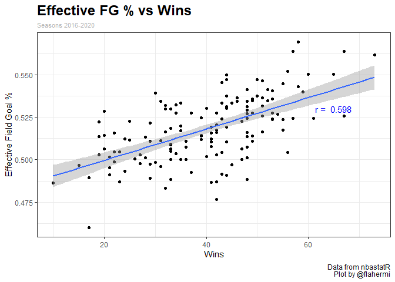
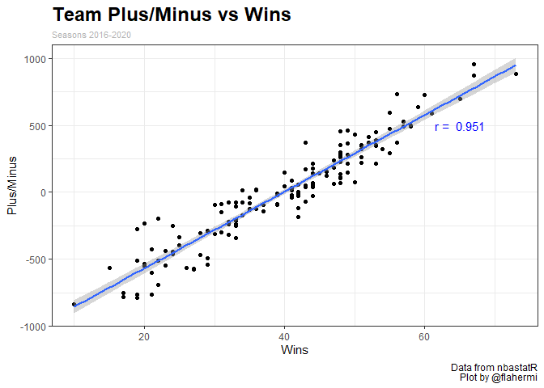

Effective Memphis Grizzlies Lineups
================
Matthew Flaherty
January 19, 2021

# Introduction

I have always wanted to look at lineups that a team plays because when
certain guys are on the court, the production just looks better than it
does when other players are on the court. I am taking advantage of this
for this post I will use lineups that the Memphis Grizzlies have played
in games to determine which lineups are the most effective in defeating
the opponent.

I measure effectiveness of a lineup in two different ways for this post.
The first is effective field goal percent (eFG%) and the second is
plus/minus (+/-). eFG% formula is `(FG + 0.5 * 3PM) / FGA` and adjusts
for the fact that a 3-point field goal is worth one more point than a
2-point field goal. For example, suppose Player A goes 4 for 10 with 2
threes, while Player B goes 5 for 10 with 0 threes. Each player would
have 10 points from field goals, and thus would have the same effective
field goal percentage (50%)
([basketball-reference](https://www.basketball-reference.com/about/glossary.html?lid=header_morelinks)).
Thus, it is a better measure of efficiency than field goal percentage.

\+/- “is a measure of the point differential when players are in and out
of a game. It is calculated by taking the difference in the score when
the player enters the game and subtracting it from the score when the
player exits the game. These differences are added up over the entire
game to give the score. Thus, it is a measure of the impact a player has
on the score of the game when he is in the game without measuring any
specific statistic.” ([Breakthrough
Basketball](https://www.breakthroughbasketball.com/stats/definitions.html)).
I can use this for lineups that teams play by getting the initial score
for a team when the lineup enters and the score for a team once the
lineup on the floor changes. This is a good measurement for how well a
lineup plays because higher numbers will result in the team doing well
when the lineup is on the court and lower numbers will show that the
team did worse with a given lineup on the floor.

# Data

The data that I will be using is from the
[nbastatR](https://github.com/abresler/nbastatR) package. I only use
data collected for the 2020-2021 NBA season thus far as I want to see
which Memphis Grizzlies lineups are playing well together.

This chunk of code is borrowed from
[ramirobentes](https://github.com/ramirobentes/NBAblog/blob/master/todo%20pbp%20lineups.R).
It is used to get all of the necessary variables that will allow me to
manipulate to get only the data for the Grizzlies.

<details>

<summary>Code</summary>

``` r
seconds_to_minutes <- function(x){
  paste0(floor(x / 60), ":", str_pad(x %% 60, side = "left", width = 2, pad = 0))
}

game_logs <- game_logs(seasons = 2021)
## Acquiring NBA basic player game logs for the 2020-21 Regular Season

games <- game_logs %>%
  select(idGame, slugTeam, slugOpponent, locationGame) %>%
  mutate(slugTeamHome = ifelse(locationGame == "H", slugTeam, slugOpponent),
         slugTeamAway = ifelse(locationGame == "A", slugTeam, slugOpponent)) %>%
  select(-c(slugTeam, slugOpponent, locationGame)) %>%
  distinct(idGame, .keep_all = TRUE)

plan(multiprocess)
play_logs_all <- play_by_play_v2(game_ids = unique(games$idGame))
## Getting play by play for game 22000002
## Getting play by play for game 22000001
## Getting play by play for game 22000011
## Getting play by play for game 22000010
## Getting play by play for game 22000004
## Getting play by play for game 22000020
## Getting play by play for game 22000019
## Getting play by play for game 22000018
## Getting play by play for game 22000015
## Getting play by play for game 22000017
## Getting play by play for game 22000003
## Getting play by play for game 22000014
## Getting play by play for game 22000013
## Getting play by play for game 22000012
## Getting play by play for game 22000009
## Getting play by play for game 22000008
## Getting play by play for game 22000007
## Getting play by play for game 22000006
## Getting play by play for game 22000005
## Getting play by play for game 22000028
## Getting play by play for game 22000029
## Getting play by play for game 22000027
## Getting play by play for game 22000026
## Getting play by play for game 22000023
## Getting play by play for game 22000025
## Getting play by play for game 22000024
## Getting play by play for game 22000022
## Getting play by play for game 22000021
## Getting play by play for game 22000030
## Getting play by play for game 22000031
## Getting play by play for game 22000035
## Getting play by play for game 22000040
## Getting play by play for game 22000039
## Getting play by play for game 22000038
## Getting play by play for game 22000037
## Getting play by play for game 22000036
## Getting play by play for game 22000034
## Getting play by play for game 22000033
## Getting play by play for game 22000032
## Getting play by play for game 22000045
## Getting play by play for game 22000044
## Getting play by play for game 22000043
## Getting play by play for game 22000042
## Getting play by play for game 22000041
## Getting play by play for game 22000046
## Getting play by play for game 22000048
## Getting play by play for game 22000055
## Getting play by play for game 22000053
## Getting play by play for game 22000054
## Getting play by play for game 22000052
## Getting play by play for game 22000051
## Getting play by play for game 22000047
## Getting play by play for game 22000050
## Getting play by play for game 22000049
## Getting play by play for game 22000061
## Getting play by play for game 22000059
## Getting play by play for game 22000060
## Getting play by play for game 22000058
## Getting play by play for game 22000056
## Getting play by play for game 22000057
## Getting play by play for game 22000068
## Getting play by play for game 22000067
## Getting play by play for game 22000066
## Getting play by play for game 22000065
## Getting play by play for game 22000064
## Getting play by play for game 22000063
## Getting play by play for game 22000062
## Getting play by play for game 22000078
## Getting play by play for game 22000070
## Getting play by play for game 22000076
## Getting play by play for game 22000077
## Getting play by play for game 22000075
## Getting play by play for game 22000073
## Getting play by play for game 22000074
## Getting play by play for game 22000072
## Getting play by play for game 22000071
## Getting play by play for game 22000069
## Getting play by play for game 22000083
## Getting play by play for game 22000082
## Getting play by play for game 22000080
## Getting play by play for game 22000081
## Getting play by play for game 22000079
## Getting play by play for game 22000084
## Getting play by play for game 22000089
## Getting play by play for game 22000088
## Getting play by play for game 22000086
## Getting play by play for game 22000087
## Getting play by play for game 22000085
## Getting play by play for game 22000090
## Getting play by play for game 22000092
## Getting play by play for game 22000091
## Getting play by play for game 22000101
## Getting play by play for game 22000100
## Getting play by play for game 22000098
## Getting play by play for game 22000099
## Getting play by play for game 22000097
## Getting play by play for game 22000095
## Getting play by play for game 22000096
## Getting play by play for game 22000094
## Getting play by play for game 22000093
## Getting play by play for game 22000102
## Getting play by play for game 22000105
## Getting play by play for game 22000106
## Getting play by play for game 22000104
## Getting play by play for game 22000103
## Getting play by play for game 22000112
## Getting play by play for game 22000109
## Getting play by play for game 22000107
## Getting play by play for game 22000108
## Getting play by play for game 22000116
## Getting play by play for game 22000117
## Getting play by play for game 22000115
## Getting play by play for game 22000114
## Getting play by play for game 22000113
## Getting play by play for game 22000110
## Getting play by play for game 22000111
## Getting play by play for game 22000120
## Getting play by play for game 22000121
## Getting play by play for game 22000122
## Getting play by play for game 22000119
## Getting play by play for game 22000118
## Getting play by play for game 22000123
## Getting play by play for game 22000125
## Getting play by play for game 22000130
## Getting play by play for game 22000131
## Getting play by play for game 22000132
## Getting play by play for game 22000129
## Getting play by play for game 22000128
## Getting play by play for game 22000127
## Getting play by play for game 22000126
## Getting play by play for game 22000124
## Getting play by play for game 22000133
## Getting play by play for game 22000134
## Getting play by play for game 22000137
## Getting play by play for game 22000140
## Getting play by play for game 22000139
## Getting play by play for game 22000138
## Getting play by play for game 22000136
## Getting play by play for game 22000135
## Getting play by play for game 22000148
## Getting play by play for game 22000147
## Getting play by play for game 22000146
## Getting play by play for game 22000144
## Getting play by play for game 22000143
## Getting play by play for game 22000142
## Getting play by play for game 22000141
## Getting play by play for game 22000155
## Getting play by play for game 22000156
## Getting play by play for game 22000153
## Getting play by play for game 22000152
## Getting play by play for game 22000150
## Getting play by play for game 22000149
## Getting play by play for game 22000151
## Getting play by play for game 22000162
## Getting play by play for game 22000157
## Getting play by play for game 22000158
## Getting play by play for game 22000159
## Getting play by play for game 22000163
## Getting play by play for game 22000161
## Getting play by play for game 22000168
## Getting play by play for game 22000165
## Getting play by play for game 22000173
## Getting play by play for game 22000172
## Getting play by play for game 22000169
## Getting play by play for game 22000170
## Getting play by play for game 22000164
## Getting play by play for game 22000177
## Getting play by play for game 22000178
## Getting play by play for game 22000176
## Getting play by play for game 22000175
## Getting play by play for game 22000174
## Getting play by play for game 22000187
## Getting play by play for game 22000188
## Getting play by play for game 22000186
## Getting play by play for game 22000184
## Getting play by play for game 22000182
## Getting play by play for game 22000181
## Getting play by play for game 22000180
## Getting play by play for game 22000191
## Getting play by play for game 22000190
## Getting play by play for game 22000189
## Getting play by play for game 22000195
## Getting play by play for game 22000192
## Getting play by play for game 22000193
## Getting play by play for game 22000198
## Getting play by play for game 22000196
## Getting play by play for game 22000202
## Getting play by play for game 22000201
## Getting play by play for game 22000200
## Getting play by play for game 22000203
## Getting play by play for game 22000212
## Getting play by play for game 22000206
## Getting play by play for game 22000211
## Getting play by play for game 22000210
## Getting play by play for game 22000209
## Getting play by play for game 22000208
## Getting play by play for game 22000207
## Getting play by play for game 22000205
## Getting play by play for game 22000214
## Getting play by play for game 22000213

new_pbp <- play_logs_all %>%
  distinct(idGame, numberEvent, .keep_all = TRUE) %>%   # remove duplicate events
  filter(numberEventMessageType != 18) %>%
  group_by(idGame) %>%
  mutate(numberEvent = row_number()) %>%  # new numberEvent column with events in the right order
  ungroup() %>%
  select(idGame, numberEventMessageType, numberEventActionType, namePlayer1, namePlayer2, namePlayer3,                   
         slugTeamPlayer1, slugTeamPlayer2,  slugTeamPlayer3, numberPeriod, timeQuarter, minuteRemainingQuarter,          
         secondsRemainingQuarter, descriptionPlayHome, numberEvent, descriptionPlayVisitor, scoreHome, scoreAway) %>%
  mutate(shotPtsHome = case_when(
    numberEventMessageType == 3 & !str_detect(descriptionPlayHome, "MISS") ~ 1,                               # Note 1
    numberEventMessageType == 1 & str_detect(descriptionPlayHome, "3PT") ~ 3,                                 # Note 2
    numberEventMessageType == 1 & !str_detect(descriptionPlayHome, "3PT") ~ 2,
    TRUE ~ 0
  )) %>%
  mutate(shotPtsAway = case_when(
    numberEventMessageType == 3 & !str_detect(descriptionPlayVisitor, "MISS") ~ 1,
    numberEventMessageType == 1 & str_detect(descriptionPlayVisitor, "3PT") ~ 3,
    numberEventMessageType == 1 & !str_detect(descriptionPlayVisitor, "3PT") ~ 2,
    TRUE ~ 0
  )) %>%
  group_by(idGame) %>%
  mutate(ptsHome = cumsum(shotPtsHome),
         ptsAway = cumsum(shotPtsAway)) %>%
  ungroup() %>%
  mutate(secsLeftQuarter = (minuteRemainingQuarter * 60) + secondsRemainingQuarter) %>%                       # Note 3 
  mutate(secsStartQuarter = case_when(                                                                        # Note 4
    numberPeriod %in% c(1:5) ~ (numberPeriod - 1) * 720,
    TRUE ~ 2880 + (numberPeriod - 5) * 300
  )) %>%
  mutate(secsPassedQuarter = ifelse(numberPeriod %in% c(1:4), 720 - secsLeftQuarter, 300 - secsLeftQuarter),  # Note 5
         secsPassedGame = secsPassedQuarter + secsStartQuarter) %>%
  left_join(games %>%
              select(idGame, slugTeamHome, slugTeamAway)) %>%
  select(idGame, numberEventMessageType, numberEventActionType, slugTeamHome, slugTeamAway, slugTeamPlayer1, slugTeamPlayer2, 
         slugTeamPlayer3, numberPeriod, timeQuarter, secsPassedGame, numberEvent, namePlayer1, namePlayer2, namePlayer3, 
         descriptionPlayHome, descriptionPlayVisitor, ptsHome, ptsAway, shotPtsHome, shotPtsAway) %>%
  mutate(marginBeforeHome = ptsHome - ptsAway - shotPtsHome + shotPtsAway,
         marginBeforeAway = ptsAway - ptsHome - shotPtsAway + shotPtsHome,
         timeQuarter = str_pad(timeQuarter, width = 5, pad = 0))
## Joining, by = "idGame"

subs_made <- new_pbp %>%
  filter(numberEventMessageType == 8) %>%        # Note 6
  mutate(slugTeamLocation = ifelse(slugTeamPlayer1 == slugTeamHome, "Home", "Away")) %>%
  select(idGame, numberPeriod, timeQuarter, secsPassedGame, slugTeamPlayer = slugTeamPlayer1,
         slugTeamLocation, playerOut = namePlayer1, playerIn = namePlayer2) %>%
  pivot_longer(cols = starts_with("player"),
               names_to = "inOut",
               names_prefix = "player",
               values_to = "namePlayer") %>%
  group_by(idGame, numberPeriod, slugTeamPlayer, namePlayer) %>%
  filter(row_number() == 1) %>%
  ungroup()

others_qtr <- new_pbp %>%
  filter(numberEventMessageType != 8) %>%                             
  filter(!(numberEventMessageType == 6 & numberEventActionType %in% c(10, 11, 16, 18, 25))) %>%     # Note 7
  pivot_longer(cols = starts_with("namePlayer"),
               names_to = "playerNumber",
               names_prefix = "namePlayer",
               values_to = "namePlayer") %>%
  mutate(slugTeamPlayer = case_when(playerNumber == 1 ~ slugTeamPlayer1,
                                    playerNumber == 2 ~ slugTeamPlayer2,
                                    playerNumber == 3 ~ slugTeamPlayer3,
                                    TRUE ~ "None")) %>%
  mutate(slugTeamLocation = ifelse(slugTeamPlayer == slugTeamHome, "Home", "Away")) %>%
  filter(!is.na(namePlayer),
         !is.na(slugTeamPlayer)) %>%
  anti_join(subs_made %>%
              select(idGame, numberPeriod, slugTeamPlayer, namePlayer)) %>%    # remove players that were subbed in the quarter
  distinct(idGame, numberPeriod, namePlayer, slugTeamPlayer, slugTeamLocation)
## Joining, by = c("idGame", "numberPeriod", "namePlayer", "slugTeamPlayer")

lineups_quarters <- subs_made %>%
  filter(inOut == "Out") %>%
  select(idGame, numberPeriod, slugTeamPlayer, namePlayer, slugTeamLocation) %>%
  bind_rows(others_qtr) %>%
  arrange(idGame, numberPeriod, slugTeamPlayer)

# lineups_quarters %>%
#   count(idGame, numberPeriod, slugTeamPlayer) %>%
#   filter(n != 5)

missing_players_ot <- tribble(
  ~idGame,   ~slugTeamPlayer,          ~namePlayer,     ~numberPeriod,
  22000023,        "DET",           "Delon Wright",           5,
  22000100,        "IND",           "Justin Holiday",         5,
  22000120,        "DEN",           "Gary Harris",            5
) %>%
  left_join(games %>%
              select(idGame, slugTeamHome, slugTeamAway)) %>%
  mutate(slugTeamLocation = ifelse(slugTeamHome == slugTeamPlayer, "Home", "Away")) %>%
  select(-c(slugTeamHome, slugTeamAway))
## Joining, by = "idGame"

lineups_quarters <- lineups_quarters %>%
  bind_rows(missing_players_ot) %>%
  arrange(idGame, numberPeriod, slugTeamPlayer)

lineup_subs <- new_pbp %>%
  filter(numberEventMessageType == 8) %>%
  select(idGame, numberPeriod, timeQuarter, secsPassedGame, slugTeamPlayer = slugTeamPlayer1, playerOut = namePlayer1, 
         playerIn = namePlayer2, numberEvent) %>%
  arrange(idGame, numberEvent) %>%
  group_by(idGame, numberPeriod, slugTeamPlayer) %>%
  mutate(row1 = row_number()) %>%
  ungroup() %>%
  left_join(lineups_quarters %>%
              group_by(idGame, numberPeriod, slugTeamPlayer) %>%
              summarise(lineupBefore = paste(sort(unique(namePlayer)), collapse = ", ")) %>%
              ungroup() %>%
              mutate(row1 = 1)) %>%
  select(-row1) %>%
  mutate(lineupBefore = str_split(lineupBefore, ", ")) %>% 
  arrange(idGame, numberEvent) %>%
  group_by(idGame, numberPeriod, slugTeamPlayer) %>%
  mutate(lineupAfter = accumulate2(playerIn, playerOut, ~setdiff(c(..1, ..2), ..3), .init = lineupBefore[[1]])[-1],
         lineupBefore = coalesce(lineupBefore, lag(lineupAfter))) %>%
  ungroup() %>% 
  mutate_all(~map_chr(., ~paste(.x, collapse = ", "))) %>%
  mutate_at(vars("numberEvent", "numberPeriod", "idGame"), ~ as.integer(.)) %>%
  mutate(secsPassedGame = as.numeric(secsPassedGame)) %>%
  arrange(idGame, numberEvent) %>%
  left_join(lineups_quarters %>%
              distinct(idGame, slugTeamPlayer, slugTeamLocation)) %>%
  filter(!is.na(slugTeamLocation))
## `summarise()` regrouping output by 'idGame', 'numberPeriod' (override with `.groups` argument)
## Joining, by = c("idGame", "numberPeriod", "slugTeamPlayer", "row1")
## Joining, by = c("idGame", "slugTeamPlayer")

lineup_game <- new_pbp %>%
  group_by(idGame, numberPeriod) %>%
  mutate(row1 = row_number()) %>%
  ungroup() %>%
  left_join(lineups_quarters %>%
              group_by(idGame, numberPeriod, slugTeamLocation) %>%
              summarise(lineupBefore = paste(sort(unique(namePlayer)), collapse = ", ")) %>%
              ungroup() %>%
              pivot_wider(names_from = slugTeamLocation,
                          names_prefix = "lineupInitial",
                          values_from = lineupBefore) %>%
              mutate(row1 = 1)) %>%
  select(-row1) %>%
  left_join(lineup_subs %>%
              mutate(lineupBeforeHome = ifelse(slugTeamLocation == "Home", lineupBefore, NA),
                     lineupAfterHome = ifelse(slugTeamLocation == "Home", lineupAfter, NA),
                     lineupBeforeAway = ifelse(slugTeamLocation == "Away", lineupBefore, NA),
                     lineupAfterAway = ifelse(slugTeamLocation == "Away", lineupAfter, NA)) %>%
              select(idGame, numberPeriod, timeQuarter, secsPassedGame, numberEvent, slugTeamPlayer1 = slugTeamPlayer,
                     contains("Home"), contains("Away"))) %>%
  mutate_at(vars(c(lineupBeforeHome, lineupAfterHome)), ~ ifelse(!is.na(lineupInitialHome), lineupInitialHome, .)) %>%
  mutate_at(vars(c(lineupBeforeAway, lineupAfterAway)), ~ ifelse(!is.na(lineupInitialAway), lineupInitialAway, .)) %>%
  select(-starts_with("lineupInitial")) %>%
  group_by(idGame, numberPeriod) %>%
  mutate(lineupHome = na.locf(lineupAfterHome, na.rm = FALSE),
         lineupAway = na.locf(lineupAfterAway, na.rm = FALSE),
         lineupHome = ifelse(is.na(lineupHome), na.locf(lineupBeforeHome, fromLast = TRUE, na.rm = FALSE), lineupHome),
         lineupAway = ifelse(is.na(lineupAway), na.locf(lineupBeforeAway, fromLast = TRUE, na.rm = FALSE), lineupAway),
         lineupHome = str_split(lineupHome, ", "),
         lineupAway = str_split(lineupAway, ", "),
         lineupHome = map_chr(lineupHome, ~ paste(sort(.), collapse = ", ")),
         lineupAway = map_chr(lineupAway, ~ paste(sort(.), collapse = ", "))) %>%
  ungroup() %>%
  select(-c(starts_with("lineupBefore"), starts_with("lineupAfter")))
## `summarise()` regrouping output by 'idGame', 'numberPeriod' (override with `.groups` argument)
## Joining, by = c("idGame", "numberPeriod", "row1")
## Joining, by = c("idGame", "slugTeamPlayer1", "numberPeriod", "timeQuarter", "secsPassedGame", "numberEvent")


lineup_game_stats <- lineup_game %>%
  mutate(canSub = case_when(numberEventMessageType == 5 & !numberEventActionType %in% c(1, 2) ~ 1,    # dead ball turnovers
                            numberEventMessageType == 6 & numberEventActionType != 16 ~ 1,            # fouls
                            numberEventMessageType == 11 & numberEventActionType != 4 ~ 1,
                            numberEventMessageType == 7 & numberEventActionType == 5 ~ 1,             # kickballs
                            numberEventMessageType == 4 & numberEventActionType == 0 & !str_detect(str_to_upper(descriptionPlayHome), "OFF:") ~ 1,
                            numberEventMessageType == 4 & numberEventActionType == 0 & !str_detect(str_to_upper(descriptionPlayVisitor), "OFF:") ~ 1,
                            TRUE ~ 0)) %>%
  mutate(secsPassedGame2 = ifelse(timeQuarter == "12:00" &
                                    (str_detect(str_to_lower(descriptionPlayHome), "technical") |
                                       str_detect(str_to_lower(descriptionPlayVisitor), "technical")),
                                  secsPassedGame + 0.5, secsPassedGame)) %>%    # Note 4
  group_by(idGame, numberPeriod, secsPassedGame) %>%
  mutate(numberNew = ifelse(numberEventMessageType == 3 & numberEventActionType == 12, 
                            paste(numberEvent[numberEventMessageType == 3 & numberEventActionType == 11], collapse = ", "), 
                            as.character(numberEvent)),
         numberNew = ifelse(numberEventMessageType == 3 & numberEventActionType %in% c(14, 15), 
                            paste(numberEvent[numberEventMessageType == 3 & numberEventActionType == 13], collapse = ", "),
                            numberNew)) %>%
  mutate(numberNew = str_split(numberNew, ", "),
         numberNew = map(numberNew, ~as.numeric(.)),
         numberNew = map2_dbl(numberNew, numberEvent, ~ max(.x[.x <= .y]))) %>%
  ungroup() %>%
  arrange(idGame, numberNew, numberEvent) %>%
  group_by(idGame) %>%
  mutate(newptsHome = cumsum(shotPtsHome),
         newptsAway = cumsum(shotPtsAway)) %>%
  group_by(idGame, numberPeriod, secsPassedGame2) %>%
  mutate(subOpp = cumsum(canSub)) %>%
  group_by(idGame = as.character(idGame), numberPeriod = as.character(numberPeriod), subOpp, secsPassedGame2 = as.character(secsPassedGame2)) %>%
  mutate(hasFouls = sum(numberEventMessageType == 3)) %>%
  mutate(newptsHome = ifelse(hasFouls > 0,
                             newptsHome[row_number() == max(row_number()[numberEventMessageType == 3])],
                             newptsHome),
         newptsAway = ifelse(hasFouls > 0,
                             newptsAway[row_number() == max(row_number()[numberEventMessageType == 3])],
                             newptsAway)) %>%
  ungroup() %>%
  select(-hasFouls) %>%
  select(-c(numberNew, secsPassedGame2)) %>%
  mutate_all(~ as.character(.)) %>%
  mutate(secsPassedGame = as.numeric(secsPassedGame),
         numberEvent = as.numeric(numberEvent))

lineup_stats <- lineup_game_stats %>%
  select(idGame, numberEvent, slugTeamHome, slugTeamAway, numberPeriod, timeQuarter, secsPassedGame, 
         newptsHome, newptsAway, lineupHome, lineupAway) %>%
  pivot_longer(cols = starts_with("lineup"),
               names_to = "lineupLocation",
               names_prefix = "lineup",
               values_to = "lineup") %>%
  mutate(ptsTeam = ifelse(lineupLocation == "Home", newptsHome, newptsAway),
         ptsOpp = ifelse(lineupLocation == "Away", newptsHome, newptsAway),
         slugTeam = ifelse(lineupLocation == "Home", slugTeamHome, slugTeamAway),
         slugOpp = ifelse(lineupLocation == "Away", slugTeamHome, slugTeamAway)) %>%
  distinct(idGame, slugTeam, slugOpp, numberPeriod, timeQuarter, secsPassedGame, ptsTeam, ptsOpp, lineup, 
           teamLocation = lineupLocation, numberEvent) %>%
  arrange(idGame, numberEvent) %>%
  group_by(idGame, slugTeam) %>%
  mutate(lineupChange = lineup != lag(lineup),
         lineupChange = coalesce(lineupChange, FALSE)) %>%
  group_by(idGame, slugTeam) %>%
  mutate(lineupStint = cumsum(lineupChange)) %>%
  ungroup() %>%
  arrange(idGame, lineupStint, numberEvent) %>%
  group_by(idGame, slugTeam, lineup, lineupStint) %>%
  summarise(initialScoreTeam = ptsTeam[row_number() == min(row_number())],
            initialScoreOpp = ptsOpp[row_number() == min(row_number())],
            finalScoreTeam = ptsTeam[row_number() == max(row_number())],
            finalScoreOpp =  ptsOpp[row_number() == max(row_number())],
            initialTime = secsPassedGame[row_number() == min(row_number())],
            finalTime = secsPassedGame[row_number() == max(row_number())]) %>%
  ungroup() %>%
  arrange(idGame, lineupStint) %>%
  group_by(idGame, slugTeam) %>%                              
  mutate(finalTime = ifelse(row_number() == max(row_number()), finalTime, lead(initialTime))) %>%  
  ungroup() %>%
  mutate(across(c(contains("Score")), ~ as.numeric(.), .names = "{col}")) %>%
  mutate(totalScoreTeam = finalScoreTeam - initialScoreTeam,
         totalScoreOpp = finalScoreOpp - initialScoreOpp,
         netScoreTeam = totalScoreTeam - totalScoreOpp,
         totalTime = finalTime - initialTime) %>%
  arrange(idGame, lineupStint)
## `summarise()` regrouping output by 'idGame', 'slugTeam', 'lineup' (override with `.groups` argument)

# indiv_stats <- lineup_stats %>%
#   separate_rows(lineup, sep = ", ") %>%
#   group_by(namePlayer = lineup, idGame, slugTeam) %>%
#   summarise(totalPlusMinus = sum(netScoreTeam),
#             totalSecs = sum(totalTime)) %>%
#   ungroup() %>%
#   arrange(-totalPlusMinus)
# 
# indiv_stats %>%
#   group_by(namePlayer) %>%
#   summarise(seasonPM = sum(totalPlusMinus),
#             seasonSecs = sum(totalSecs)) %>%
#   ungroup() %>%
#   arrange(-seasonPM) %>%
#   mutate(seasonMin = paste0(floor(seasonSecs / 60), ":", str_pad(round(seasonSecs %% 60, 0), side = "left", width = 2, pad = 0))) %>%
#   select(-seasonSecs)
# 
# lineup_stats %>%
#   group_by(lineup) %>%
#   summarise(seasonPM = sum(netScoreTeam),
#             seasonSecs = sum(totalTime)) %>%
#   ungroup() %>%
#   arrange(-seasonPM, -seasonSecs) %>%
#   mutate(seasonMin = paste0(floor(seasonSecs / 60), ":", str_pad(round(seasonSecs %% 60, 0), side = "left", width = 2, pad = 0))) %>%
#   select(-seasonSecs)

rm(lineup_game, games, df_nba_player_dict, lineup_subs, missing_players_ot, others_qtr, subs_made)
```

</details>

# Effective Lineups

<details>

<summary>Code</summary>

``` r
game_filter <- game_logs %>%
  filter(yearSeason == 2021)%>%
  summarise(max_game = max(idGame)) %>%
  pull(max_game)
```

</details>

The lineups in this table are the top 15 lineups that the Grizzlies have
used. I was not sure what the cutoff for minutes played by a lineup
should be so I took the top 15 lineups for minutes played.

``` r
grizz_lineups <- lineup_stats %>%
  filter(idGame <= game_filter) %>%
  filter(slugTeam == "MEM") %>%
  group_by(lineup) %>%
  summarise(min_played = round(sum(totalTime)/60,3),
            bpm = round(sum(netScoreTeam)/min_played,3)) %>%
  ungroup() %>%
  arrange(-min_played) %>%
  slice(1:15)
```

    ## `summarise()` ungrouping output (override with `.groups` argument)

``` r
grizz_lineups %>%
  mutate(Rank = row_number()) %>%
  rename(Lineup = lineup,
         'Minutes Played' = min_played,
         "PM/min" = bpm) %>%
  select(Rank, everything())%>%
  gt() %>%
  tab_header(
    title = "Memphis Grizzlies Most Popular Lineups",
    subtitle = "2021 Season"
  ) %>%
  data_color(
    columns = vars("Minutes Played"),
    colors = "yellow")
```

<!--html_preserve-->

<style>html {
  font-family: -apple-system, BlinkMacSystemFont, 'Segoe UI', Roboto, Oxygen, Ubuntu, Cantarell, 'Helvetica Neue', 'Fira Sans', 'Droid Sans', Arial, sans-serif;
}

#ipozakrbmr .gt_table {
  display: table;
  border-collapse: collapse;
  margin-left: auto;
  margin-right: auto;
  color: #333333;
  font-size: 16px;
  font-weight: normal;
  font-style: normal;
  background-color: #FFFFFF;
  width: auto;
  border-top-style: solid;
  border-top-width: 2px;
  border-top-color: #A8A8A8;
  border-right-style: none;
  border-right-width: 2px;
  border-right-color: #D3D3D3;
  border-bottom-style: solid;
  border-bottom-width: 2px;
  border-bottom-color: #A8A8A8;
  border-left-style: none;
  border-left-width: 2px;
  border-left-color: #D3D3D3;
}

#ipozakrbmr .gt_heading {
  background-color: #FFFFFF;
  text-align: center;
  border-bottom-color: #FFFFFF;
  border-left-style: none;
  border-left-width: 1px;
  border-left-color: #D3D3D3;
  border-right-style: none;
  border-right-width: 1px;
  border-right-color: #D3D3D3;
}

#ipozakrbmr .gt_title {
  color: #333333;
  font-size: 125%;
  font-weight: initial;
  padding-top: 4px;
  padding-bottom: 4px;
  border-bottom-color: #FFFFFF;
  border-bottom-width: 0;
}

#ipozakrbmr .gt_subtitle {
  color: #333333;
  font-size: 85%;
  font-weight: initial;
  padding-top: 0;
  padding-bottom: 4px;
  border-top-color: #FFFFFF;
  border-top-width: 0;
}

#ipozakrbmr .gt_bottom_border {
  border-bottom-style: solid;
  border-bottom-width: 2px;
  border-bottom-color: #D3D3D3;
}

#ipozakrbmr .gt_col_headings {
  border-top-style: solid;
  border-top-width: 2px;
  border-top-color: #D3D3D3;
  border-bottom-style: solid;
  border-bottom-width: 2px;
  border-bottom-color: #D3D3D3;
  border-left-style: none;
  border-left-width: 1px;
  border-left-color: #D3D3D3;
  border-right-style: none;
  border-right-width: 1px;
  border-right-color: #D3D3D3;
}

#ipozakrbmr .gt_col_heading {
  color: #333333;
  background-color: #FFFFFF;
  font-size: 100%;
  font-weight: normal;
  text-transform: inherit;
  border-left-style: none;
  border-left-width: 1px;
  border-left-color: #D3D3D3;
  border-right-style: none;
  border-right-width: 1px;
  border-right-color: #D3D3D3;
  vertical-align: bottom;
  padding-top: 5px;
  padding-bottom: 6px;
  padding-left: 5px;
  padding-right: 5px;
  overflow-x: hidden;
}

#ipozakrbmr .gt_column_spanner_outer {
  color: #333333;
  background-color: #FFFFFF;
  font-size: 100%;
  font-weight: normal;
  text-transform: inherit;
  padding-top: 0;
  padding-bottom: 0;
  padding-left: 4px;
  padding-right: 4px;
}

#ipozakrbmr .gt_column_spanner_outer:first-child {
  padding-left: 0;
}

#ipozakrbmr .gt_column_spanner_outer:last-child {
  padding-right: 0;
}

#ipozakrbmr .gt_column_spanner {
  border-bottom-style: solid;
  border-bottom-width: 2px;
  border-bottom-color: #D3D3D3;
  vertical-align: bottom;
  padding-top: 5px;
  padding-bottom: 6px;
  overflow-x: hidden;
  display: inline-block;
  width: 100%;
}

#ipozakrbmr .gt_group_heading {
  padding: 8px;
  color: #333333;
  background-color: #FFFFFF;
  font-size: 100%;
  font-weight: initial;
  text-transform: inherit;
  border-top-style: solid;
  border-top-width: 2px;
  border-top-color: #D3D3D3;
  border-bottom-style: solid;
  border-bottom-width: 2px;
  border-bottom-color: #D3D3D3;
  border-left-style: none;
  border-left-width: 1px;
  border-left-color: #D3D3D3;
  border-right-style: none;
  border-right-width: 1px;
  border-right-color: #D3D3D3;
  vertical-align: middle;
}

#ipozakrbmr .gt_empty_group_heading {
  padding: 0.5px;
  color: #333333;
  background-color: #FFFFFF;
  font-size: 100%;
  font-weight: initial;
  border-top-style: solid;
  border-top-width: 2px;
  border-top-color: #D3D3D3;
  border-bottom-style: solid;
  border-bottom-width: 2px;
  border-bottom-color: #D3D3D3;
  vertical-align: middle;
}

#ipozakrbmr .gt_from_md > :first-child {
  margin-top: 0;
}

#ipozakrbmr .gt_from_md > :last-child {
  margin-bottom: 0;
}

#ipozakrbmr .gt_row {
  padding-top: 8px;
  padding-bottom: 8px;
  padding-left: 5px;
  padding-right: 5px;
  margin: 10px;
  border-top-style: solid;
  border-top-width: 1px;
  border-top-color: #D3D3D3;
  border-left-style: none;
  border-left-width: 1px;
  border-left-color: #D3D3D3;
  border-right-style: none;
  border-right-width: 1px;
  border-right-color: #D3D3D3;
  vertical-align: middle;
  overflow-x: hidden;
}

#ipozakrbmr .gt_stub {
  color: #333333;
  background-color: #FFFFFF;
  font-size: 100%;
  font-weight: initial;
  text-transform: inherit;
  border-right-style: solid;
  border-right-width: 2px;
  border-right-color: #D3D3D3;
  padding-left: 12px;
}

#ipozakrbmr .gt_summary_row {
  color: #333333;
  background-color: #FFFFFF;
  text-transform: inherit;
  padding-top: 8px;
  padding-bottom: 8px;
  padding-left: 5px;
  padding-right: 5px;
}

#ipozakrbmr .gt_first_summary_row {
  padding-top: 8px;
  padding-bottom: 8px;
  padding-left: 5px;
  padding-right: 5px;
  border-top-style: solid;
  border-top-width: 2px;
  border-top-color: #D3D3D3;
}

#ipozakrbmr .gt_grand_summary_row {
  color: #333333;
  background-color: #FFFFFF;
  text-transform: inherit;
  padding-top: 8px;
  padding-bottom: 8px;
  padding-left: 5px;
  padding-right: 5px;
}

#ipozakrbmr .gt_first_grand_summary_row {
  padding-top: 8px;
  padding-bottom: 8px;
  padding-left: 5px;
  padding-right: 5px;
  border-top-style: double;
  border-top-width: 6px;
  border-top-color: #D3D3D3;
}

#ipozakrbmr .gt_striped {
  background-color: rgba(128, 128, 128, 0.05);
}

#ipozakrbmr .gt_table_body {
  border-top-style: solid;
  border-top-width: 2px;
  border-top-color: #D3D3D3;
  border-bottom-style: solid;
  border-bottom-width: 2px;
  border-bottom-color: #D3D3D3;
}

#ipozakrbmr .gt_footnotes {
  color: #333333;
  background-color: #FFFFFF;
  border-bottom-style: none;
  border-bottom-width: 2px;
  border-bottom-color: #D3D3D3;
  border-left-style: none;
  border-left-width: 2px;
  border-left-color: #D3D3D3;
  border-right-style: none;
  border-right-width: 2px;
  border-right-color: #D3D3D3;
}

#ipozakrbmr .gt_footnote {
  margin: 0px;
  font-size: 90%;
  padding: 4px;
}

#ipozakrbmr .gt_sourcenotes {
  color: #333333;
  background-color: #FFFFFF;
  border-bottom-style: none;
  border-bottom-width: 2px;
  border-bottom-color: #D3D3D3;
  border-left-style: none;
  border-left-width: 2px;
  border-left-color: #D3D3D3;
  border-right-style: none;
  border-right-width: 2px;
  border-right-color: #D3D3D3;
}

#ipozakrbmr .gt_sourcenote {
  font-size: 90%;
  padding: 4px;
}

#ipozakrbmr .gt_left {
  text-align: left;
}

#ipozakrbmr .gt_center {
  text-align: center;
}

#ipozakrbmr .gt_right {
  text-align: right;
  font-variant-numeric: tabular-nums;
}

#ipozakrbmr .gt_font_normal {
  font-weight: normal;
}

#ipozakrbmr .gt_font_bold {
  font-weight: bold;
}

#ipozakrbmr .gt_font_italic {
  font-style: italic;
}

#ipozakrbmr .gt_super {
  font-size: 65%;
}

#ipozakrbmr .gt_footnote_marks {
  font-style: italic;
  font-size: 65%;
}
</style>

<div id="ipozakrbmr" style="overflow-x:auto;overflow-y:auto;width:auto;height:auto;">

<table class="gt_table">

<thead class="gt_header">

<tr>

<th colspan="4" class="gt_heading gt_title gt_font_normal" style>

Memphis Grizzlies Most Popular Lineups

</th>

</tr>

<tr>

<th colspan="4" class="gt_heading gt_subtitle gt_font_normal gt_bottom_border" style>

2021 Season

</th>

</tr>

</thead>

<thead class="gt_col_headings">

<tr>

<th class="gt_col_heading gt_columns_bottom_border gt_center" rowspan="1" colspan="1">

Rank

</th>

<th class="gt_col_heading gt_columns_bottom_border gt_left" rowspan="1" colspan="1">

Lineup

</th>

<th class="gt_col_heading gt_columns_bottom_border gt_right" rowspan="1" colspan="1">

Minutes Played

</th>

<th class="gt_col_heading gt_columns_bottom_border gt_right" rowspan="1" colspan="1">

PM/min

</th>

</tr>

</thead>

<tbody class="gt_table_body">

<tr>

<td class="gt_row gt_center">

1

</td>

<td class="gt_row gt_left">

Brandon Clarke, Dillon Brooks, Jonas Valanciunas, Kyle Anderson, Tyus
Jones

</td>

<td class="gt_row gt_right" style="background-color: #FFFF00; color: #000000;">

85.383

</td>

<td class="gt_row gt_right">

\-0.258

</td>

</tr>

<tr>

<td class="gt_row gt_center">

2

</td>

<td class="gt_row gt_left">

Dillon Brooks, Grayson Allen, Ja Morant, Jonas Valanciunas, Kyle
Anderson

</td>

<td class="gt_row gt_right" style="background-color: #FFFF00; color: #000000;">

35.050

</td>

<td class="gt_row gt_right">

0.485

</td>

</tr>

<tr>

<td class="gt_row gt_center">

3

</td>

<td class="gt_row gt_left">

Brandon Clarke, Dillon Brooks, Ja Morant, Kyle Anderson, Xavier Tillman

</td>

<td class="gt_row gt_right" style="background-color: #FFFF00; color: #000000;">

20.367

</td>

<td class="gt_row gt_right">

\-0.049

</td>

</tr>

<tr>

<td class="gt_row gt_center">

4

</td>

<td class="gt_row gt_left">

De’Anthony Melton, Desmond Bane, Grayson Allen, Kyle Anderson, Xavier
Tillman

</td>

<td class="gt_row gt_right" style="background-color: #FFFF00; color: #000000;">

17.933

</td>

<td class="gt_row gt_right">

0.446

</td>

</tr>

<tr>

<td class="gt_row gt_center">

5

</td>

<td class="gt_row gt_left">

Dillon Brooks, Grayson Allen, Jonas Valanciunas, Kyle Anderson, Tyus
Jones

</td>

<td class="gt_row gt_right" style="background-color: #FFFF00; color: #000000;">

16.083

</td>

<td class="gt_row gt_right">

\-0.373

</td>

</tr>

<tr>

<td class="gt_row gt_center">

6

</td>

<td class="gt_row gt_left">

Brandon Clarke, Desmond Bane, Dillon Brooks, Tyus Jones, Xavier Tillman

</td>

<td class="gt_row gt_right" style="background-color: #FFFF00; color: #000000;">

15.317

</td>

<td class="gt_row gt_right">

0.457

</td>

</tr>

<tr>

<td class="gt_row gt_center">

7

</td>

<td class="gt_row gt_left">

Brandon Clarke, Desmond Bane, Dillon Brooks, Jonas Valanciunas, Tyus
Jones

</td>

<td class="gt_row gt_right" style="background-color: #FFFF00; color: #000000;">

13.183

</td>

<td class="gt_row gt_right">

0.379

</td>

</tr>

<tr>

<td class="gt_row gt_center">

8

</td>

<td class="gt_row gt_left">

De’Anthony Melton, Desmond Bane, Gorgui Dieng, Grayson Allen, Xavier
Tillman

</td>

<td class="gt_row gt_right" style="background-color: #FFFF00; color: #000000;">

12.550

</td>

<td class="gt_row gt_right">

1.195

</td>

</tr>

<tr>

<td class="gt_row gt_center">

9

</td>

<td class="gt_row gt_left">

Brandon Clarke, Dillon Brooks, Grayson Allen, Jonas Valanciunas, Tim
Frazier

</td>

<td class="gt_row gt_right" style="background-color: #FFFF00; color: #000000;">

12.367

</td>

<td class="gt_row gt_right">

0.647

</td>

</tr>

<tr>

<td class="gt_row gt_center">

10

</td>

<td class="gt_row gt_left">

Brandon Clarke, John Konchar, Jonas Valanciunas, Kyle Anderson, Tyus
Jones

</td>

<td class="gt_row gt_right" style="background-color: #FFFF00; color: #000000;">

12.083

</td>

<td class="gt_row gt_right">

0.083

</td>

</tr>

<tr>

<td class="gt_row gt_center">

11

</td>

<td class="gt_row gt_left">

Brandon Clarke, Desmond Bane, Gorgui Dieng, Grayson Allen, Tyus Jones

</td>

<td class="gt_row gt_right" style="background-color: #FFFF00; color: #000000;">

11.600

</td>

<td class="gt_row gt_right">

0.086

</td>

</tr>

<tr>

<td class="gt_row gt_center">

12

</td>

<td class="gt_row gt_left">

Brandon Clarke, Desmond Bane, Gorgui Dieng, John Konchar, Sean McDermott

</td>

<td class="gt_row gt_right" style="background-color: #FFFF00; color: #000000;">

11.300

</td>

<td class="gt_row gt_right">

\-0.442

</td>

</tr>

<tr>

<td class="gt_row gt_center">

13

</td>

<td class="gt_row gt_left">

Desmond Bane, Dillon Brooks, Jonas Valanciunas, Kyle Anderson, Tyus
Jones

</td>

<td class="gt_row gt_right" style="background-color: #FFFF00; color: #000000;">

11.250

</td>

<td class="gt_row gt_right">

\-0.089

</td>

</tr>

<tr>

<td class="gt_row gt_center">

14

</td>

<td class="gt_row gt_left">

Brandon Clarke, Dillon Brooks, Grayson Allen, Jonas Valanciunas, Tyus
Jones

</td>

<td class="gt_row gt_right" style="background-color: #FFFF00; color: #000000;">

10.950

</td>

<td class="gt_row gt_right">

\-0.274

</td>

</tr>

<tr>

<td class="gt_row gt_center">

15

</td>

<td class="gt_row gt_left">

De’Anthony Melton, Grayson Allen, Jonas Valanciunas, Kyle Anderson, Tim
Frazier

</td>

<td class="gt_row gt_right" style="background-color: #FFFF00; color: #000000;">

9.300

</td>

<td class="gt_row gt_right">

\-0.215

</td>

</tr>

</tbody>

</table>

</div>

<!--/html_preserve-->

The lineup that has the most minutes played is not the typical starting
lineup for the Grizzlies as they are not at full health. Ja Morant had
to miss a few weeks with an ankle injury and Jaren Jackson Jr. has yet
to dress out for a game. Thus, the lineup with the most minutes played
was the starting group while Morant was out.

## Effective FG %

I am going to plot the eFG% vs teams wins in a season to see if there is
any correlation. If there is, then the Grizzlies should look to maximize
the time that the lineups with good eFG% have on the court.

<details>

<summary>Code</summary>

``` r
team_stats <- bref_teams_stats(seasons = 2016:2020)
## Parsing https://www.basketball-reference.com/leagues/NBA_2016.html
## Parsing https://www.basketball-reference.com/leagues/NBA_2017.html
## Parsing https://www.basketball-reference.com/leagues/NBA_2018.html
## Parsing https://www.basketball-reference.com/leagues/NBA_2019.html
## Parsing https://www.basketball-reference.com/leagues/NBA_2020.html
## StandingsConf
## Assigning NBA player dictionary to df_dict_nba_players to your environment
## StandingsDiv
## Assigning NBA player dictionary to df_dict_nba_players to your environment
## PerGame
## Assigning NBA player dictionary to df_dict_nba_players to your environment
## Totals
## Assigning NBA player dictionary to df_dict_nba_players to your environment
## PerPoss
## Assigning NBA player dictionary to df_dict_nba_players to your environment
## Misc
## Assigning NBA player dictionary to df_dict_nba_players to your environment
## Shooting
## Assigning NBA player dictionary to df_dict_nba_players to your environment
team_stats <- as.data.frame(team_stats$dataTable)

team_efg <- team_stats %>%
  mutate(efg = (team_stats$fgmPerGameTeam + 0.5 * team_stats$fg3mPerGameTeam)/ team_stats$fgaPerGameTeam)
```

</details>

``` r
ggplot(team_efg, aes(x = winsTeam, y = efg))+
  geom_point()+
  annotate(geom = "text", x = 65, y = 0.53, label = paste("r = ", round(cor(team_efg$winsTeam,team_efg$efg),3)), col = "blue") +
  geom_smooth(method = "lm") +
  labs(
    title = "Effective FG % vs Wins",
    subtitle = "Seasons 2016-2020",
    x = "Wins",
    y = "Effective Field Goal %",
    caption = "Data from nbastatR\nPlot by @flahermi"
  ) +
  theme_bw() +
  theme(
    plot.subtitle = element_text(size = 8, colour = "grey70"),
    plot.title = element_text(size = 18, face = "bold")
  ) 
```

    ## `geom_smooth()` using formula 'y ~ x'

<!-- -->

There is moderate correlation between eFG% and wins. Thus, this
statistic could be used as a measurement of how well a lineup is
playing. Using the top 15 lineups played, I can find the most efficient
lineup using eFG%.

<details>

<summary>Code</summary>

``` r
grizz_best <- lineup_game_stats %>%
  filter(idGame <= game_filter) %>%
  filter(numberEventMessageType %in% c(1,2)) %>%
  mutate(shotPts = if_else(slugTeamPlayer1 == slugTeamHome, shotPtsHome, shotPtsAway),
         lineup = if_else(slugTeamPlayer1 == slugTeamHome, lineupHome, lineupAway)) %>%
  count(lineup, shotPts) %>%
  filter(lineup %in% grizz_lineups$lineup) %>%
  pivot_wider(names_from = shotPts,
              values_from = n,
              values_fill = 0) %>%
  janitor::clean_names()%>%
  mutate(effective_fg = round(((x2 + x3) + 0.5 * x3) / (x0 + x2 + x3),4)*100) %>%
  arrange(-effective_fg)

#  add minutes played and BPM by this lineup
#  this will allow me to assess if this lineup needs to play more
grizz_best <- grizz_best %>%
  mutate(min_played = NA,
         bpm = NA)

for (i in 1:length(grizz_best$lineup)) {
  for (j in 1:length(grizz_lineups$lineup)) {
    if (grizz_best$lineup[i] == grizz_lineups$lineup[j]){
      grizz_best$min_played[i] <- grizz_lineups$min_played[j]
      grizz_best$bpm[i] <- grizz_lineups$bpm[j]
    } 
  }
}
```

</details>

``` r
grizz_best %>%
  mutate(Rank = row_number(),
         FG = x0 + x2 + x3,
         "2FGM" = x2,
         "3FGM" = x3) %>%
  rename(Lineup = lineup,
         'Minutes Played' = min_played,
         'PM/min' = bpm, 
         'Effective FG%' = effective_fg) %>%
  select(Rank, Lineup, FG, "2FGM", "3FGM", "Effective FG%", "Minutes Played", 'PM/min',-x0, -x2, -x3) %>%
  gt() %>%
  tab_header(
    title = "Memphis Grizzlies Lineups by eFG%",
    subtitle = "2021 Season"
  ) %>%
  data_color(
    columns = vars("Effective FG%"),
    colors = "yellow")
```

<!--html_preserve-->

<style>html {
  font-family: -apple-system, BlinkMacSystemFont, 'Segoe UI', Roboto, Oxygen, Ubuntu, Cantarell, 'Helvetica Neue', 'Fira Sans', 'Droid Sans', Arial, sans-serif;
}

#pnppiloxdo .gt_table {
  display: table;
  border-collapse: collapse;
  margin-left: auto;
  margin-right: auto;
  color: #333333;
  font-size: 16px;
  font-weight: normal;
  font-style: normal;
  background-color: #FFFFFF;
  width: auto;
  border-top-style: solid;
  border-top-width: 2px;
  border-top-color: #A8A8A8;
  border-right-style: none;
  border-right-width: 2px;
  border-right-color: #D3D3D3;
  border-bottom-style: solid;
  border-bottom-width: 2px;
  border-bottom-color: #A8A8A8;
  border-left-style: none;
  border-left-width: 2px;
  border-left-color: #D3D3D3;
}

#pnppiloxdo .gt_heading {
  background-color: #FFFFFF;
  text-align: center;
  border-bottom-color: #FFFFFF;
  border-left-style: none;
  border-left-width: 1px;
  border-left-color: #D3D3D3;
  border-right-style: none;
  border-right-width: 1px;
  border-right-color: #D3D3D3;
}

#pnppiloxdo .gt_title {
  color: #333333;
  font-size: 125%;
  font-weight: initial;
  padding-top: 4px;
  padding-bottom: 4px;
  border-bottom-color: #FFFFFF;
  border-bottom-width: 0;
}

#pnppiloxdo .gt_subtitle {
  color: #333333;
  font-size: 85%;
  font-weight: initial;
  padding-top: 0;
  padding-bottom: 4px;
  border-top-color: #FFFFFF;
  border-top-width: 0;
}

#pnppiloxdo .gt_bottom_border {
  border-bottom-style: solid;
  border-bottom-width: 2px;
  border-bottom-color: #D3D3D3;
}

#pnppiloxdo .gt_col_headings {
  border-top-style: solid;
  border-top-width: 2px;
  border-top-color: #D3D3D3;
  border-bottom-style: solid;
  border-bottom-width: 2px;
  border-bottom-color: #D3D3D3;
  border-left-style: none;
  border-left-width: 1px;
  border-left-color: #D3D3D3;
  border-right-style: none;
  border-right-width: 1px;
  border-right-color: #D3D3D3;
}

#pnppiloxdo .gt_col_heading {
  color: #333333;
  background-color: #FFFFFF;
  font-size: 100%;
  font-weight: normal;
  text-transform: inherit;
  border-left-style: none;
  border-left-width: 1px;
  border-left-color: #D3D3D3;
  border-right-style: none;
  border-right-width: 1px;
  border-right-color: #D3D3D3;
  vertical-align: bottom;
  padding-top: 5px;
  padding-bottom: 6px;
  padding-left: 5px;
  padding-right: 5px;
  overflow-x: hidden;
}

#pnppiloxdo .gt_column_spanner_outer {
  color: #333333;
  background-color: #FFFFFF;
  font-size: 100%;
  font-weight: normal;
  text-transform: inherit;
  padding-top: 0;
  padding-bottom: 0;
  padding-left: 4px;
  padding-right: 4px;
}

#pnppiloxdo .gt_column_spanner_outer:first-child {
  padding-left: 0;
}

#pnppiloxdo .gt_column_spanner_outer:last-child {
  padding-right: 0;
}

#pnppiloxdo .gt_column_spanner {
  border-bottom-style: solid;
  border-bottom-width: 2px;
  border-bottom-color: #D3D3D3;
  vertical-align: bottom;
  padding-top: 5px;
  padding-bottom: 6px;
  overflow-x: hidden;
  display: inline-block;
  width: 100%;
}

#pnppiloxdo .gt_group_heading {
  padding: 8px;
  color: #333333;
  background-color: #FFFFFF;
  font-size: 100%;
  font-weight: initial;
  text-transform: inherit;
  border-top-style: solid;
  border-top-width: 2px;
  border-top-color: #D3D3D3;
  border-bottom-style: solid;
  border-bottom-width: 2px;
  border-bottom-color: #D3D3D3;
  border-left-style: none;
  border-left-width: 1px;
  border-left-color: #D3D3D3;
  border-right-style: none;
  border-right-width: 1px;
  border-right-color: #D3D3D3;
  vertical-align: middle;
}

#pnppiloxdo .gt_empty_group_heading {
  padding: 0.5px;
  color: #333333;
  background-color: #FFFFFF;
  font-size: 100%;
  font-weight: initial;
  border-top-style: solid;
  border-top-width: 2px;
  border-top-color: #D3D3D3;
  border-bottom-style: solid;
  border-bottom-width: 2px;
  border-bottom-color: #D3D3D3;
  vertical-align: middle;
}

#pnppiloxdo .gt_from_md > :first-child {
  margin-top: 0;
}

#pnppiloxdo .gt_from_md > :last-child {
  margin-bottom: 0;
}

#pnppiloxdo .gt_row {
  padding-top: 8px;
  padding-bottom: 8px;
  padding-left: 5px;
  padding-right: 5px;
  margin: 10px;
  border-top-style: solid;
  border-top-width: 1px;
  border-top-color: #D3D3D3;
  border-left-style: none;
  border-left-width: 1px;
  border-left-color: #D3D3D3;
  border-right-style: none;
  border-right-width: 1px;
  border-right-color: #D3D3D3;
  vertical-align: middle;
  overflow-x: hidden;
}

#pnppiloxdo .gt_stub {
  color: #333333;
  background-color: #FFFFFF;
  font-size: 100%;
  font-weight: initial;
  text-transform: inherit;
  border-right-style: solid;
  border-right-width: 2px;
  border-right-color: #D3D3D3;
  padding-left: 12px;
}

#pnppiloxdo .gt_summary_row {
  color: #333333;
  background-color: #FFFFFF;
  text-transform: inherit;
  padding-top: 8px;
  padding-bottom: 8px;
  padding-left: 5px;
  padding-right: 5px;
}

#pnppiloxdo .gt_first_summary_row {
  padding-top: 8px;
  padding-bottom: 8px;
  padding-left: 5px;
  padding-right: 5px;
  border-top-style: solid;
  border-top-width: 2px;
  border-top-color: #D3D3D3;
}

#pnppiloxdo .gt_grand_summary_row {
  color: #333333;
  background-color: #FFFFFF;
  text-transform: inherit;
  padding-top: 8px;
  padding-bottom: 8px;
  padding-left: 5px;
  padding-right: 5px;
}

#pnppiloxdo .gt_first_grand_summary_row {
  padding-top: 8px;
  padding-bottom: 8px;
  padding-left: 5px;
  padding-right: 5px;
  border-top-style: double;
  border-top-width: 6px;
  border-top-color: #D3D3D3;
}

#pnppiloxdo .gt_striped {
  background-color: rgba(128, 128, 128, 0.05);
}

#pnppiloxdo .gt_table_body {
  border-top-style: solid;
  border-top-width: 2px;
  border-top-color: #D3D3D3;
  border-bottom-style: solid;
  border-bottom-width: 2px;
  border-bottom-color: #D3D3D3;
}

#pnppiloxdo .gt_footnotes {
  color: #333333;
  background-color: #FFFFFF;
  border-bottom-style: none;
  border-bottom-width: 2px;
  border-bottom-color: #D3D3D3;
  border-left-style: none;
  border-left-width: 2px;
  border-left-color: #D3D3D3;
  border-right-style: none;
  border-right-width: 2px;
  border-right-color: #D3D3D3;
}

#pnppiloxdo .gt_footnote {
  margin: 0px;
  font-size: 90%;
  padding: 4px;
}

#pnppiloxdo .gt_sourcenotes {
  color: #333333;
  background-color: #FFFFFF;
  border-bottom-style: none;
  border-bottom-width: 2px;
  border-bottom-color: #D3D3D3;
  border-left-style: none;
  border-left-width: 2px;
  border-left-color: #D3D3D3;
  border-right-style: none;
  border-right-width: 2px;
  border-right-color: #D3D3D3;
}

#pnppiloxdo .gt_sourcenote {
  font-size: 90%;
  padding: 4px;
}

#pnppiloxdo .gt_left {
  text-align: left;
}

#pnppiloxdo .gt_center {
  text-align: center;
}

#pnppiloxdo .gt_right {
  text-align: right;
  font-variant-numeric: tabular-nums;
}

#pnppiloxdo .gt_font_normal {
  font-weight: normal;
}

#pnppiloxdo .gt_font_bold {
  font-weight: bold;
}

#pnppiloxdo .gt_font_italic {
  font-style: italic;
}

#pnppiloxdo .gt_super {
  font-size: 65%;
}

#pnppiloxdo .gt_footnote_marks {
  font-style: italic;
  font-size: 65%;
}
</style>

<div id="pnppiloxdo" style="overflow-x:auto;overflow-y:auto;width:auto;height:auto;">

<table class="gt_table">

<thead class="gt_header">

<tr>

<th colspan="8" class="gt_heading gt_title gt_font_normal" style>

Memphis Grizzlies Lineups by eFG%

</th>

</tr>

<tr>

<th colspan="8" class="gt_heading gt_subtitle gt_font_normal gt_bottom_border" style>

2021 Season

</th>

</tr>

</thead>

<thead class="gt_col_headings">

<tr>

<th class="gt_col_heading gt_columns_bottom_border gt_center" rowspan="1" colspan="1">

Rank

</th>

<th class="gt_col_heading gt_columns_bottom_border gt_left" rowspan="1" colspan="1">

Lineup

</th>

<th class="gt_col_heading gt_columns_bottom_border gt_center" rowspan="1" colspan="1">

FG

</th>

<th class="gt_col_heading gt_columns_bottom_border gt_center" rowspan="1" colspan="1">

2FGM

</th>

<th class="gt_col_heading gt_columns_bottom_border gt_center" rowspan="1" colspan="1">

3FGM

</th>

<th class="gt_col_heading gt_columns_bottom_border gt_right" rowspan="1" colspan="1">

Effective FG%

</th>

<th class="gt_col_heading gt_columns_bottom_border gt_right" rowspan="1" colspan="1">

Minutes Played

</th>

<th class="gt_col_heading gt_columns_bottom_border gt_right" rowspan="1" colspan="1">

PM/min

</th>

</tr>

</thead>

<tbody class="gt_table_body">

<tr>

<td class="gt_row gt_center">

1

</td>

<td class="gt_row gt_left">

Brandon Clarke, Desmond Bane, Dillon Brooks, Jonas Valanciunas, Tyus
Jones

</td>

<td class="gt_row gt_center">

26

</td>

<td class="gt_row gt_center">

9

</td>

<td class="gt_row gt_center">

5

</td>

<td class="gt_row gt_right" style="background-color: #FFFF00; color: #000000;">

63.46

</td>

<td class="gt_row gt_right">

13.183

</td>

<td class="gt_row gt_right">

0.379

</td>

</tr>

<tr>

<td class="gt_row gt_center">

2

</td>

<td class="gt_row gt_left">

Brandon Clarke, Desmond Bane, Gorgui Dieng, Grayson Allen, Tyus Jones

</td>

<td class="gt_row gt_center">

21

</td>

<td class="gt_row gt_center">

7

</td>

<td class="gt_row gt_center">

4

</td>

<td class="gt_row gt_right" style="background-color: #FFFF00; color: #000000;">

61.90

</td>

<td class="gt_row gt_right">

11.600

</td>

<td class="gt_row gt_right">

0.086

</td>

</tr>

<tr>

<td class="gt_row gt_center">

3

</td>

<td class="gt_row gt_left">

Brandon Clarke, Desmond Bane, Dillon Brooks, Tyus Jones, Xavier Tillman

</td>

<td class="gt_row gt_center">

29

</td>

<td class="gt_row gt_center">

16

</td>

<td class="gt_row gt_center">

1

</td>

<td class="gt_row gt_right" style="background-color: #FFFF00; color: #000000;">

60.34

</td>

<td class="gt_row gt_right">

15.317

</td>

<td class="gt_row gt_right">

0.457

</td>

</tr>

<tr>

<td class="gt_row gt_center">

4

</td>

<td class="gt_row gt_left">

De’Anthony Melton, Desmond Bane, Grayson Allen, Kyle Anderson, Xavier
Tillman

</td>

<td class="gt_row gt_center">

37

</td>

<td class="gt_row gt_center">

16

</td>

<td class="gt_row gt_center">

4

</td>

<td class="gt_row gt_right" style="background-color: #FFFF00; color: #000000;">

59.46

</td>

<td class="gt_row gt_right">

17.933

</td>

<td class="gt_row gt_right">

0.446

</td>

</tr>

<tr>

<td class="gt_row gt_center">

5

</td>

<td class="gt_row gt_left">

Dillon Brooks, Grayson Allen, Ja Morant, Jonas Valanciunas, Kyle
Anderson

</td>

<td class="gt_row gt_center">

75

</td>

<td class="gt_row gt_center">

22

</td>

<td class="gt_row gt_center">

14

</td>

<td class="gt_row gt_right" style="background-color: #FFFF00; color: #000000;">

57.33

</td>

<td class="gt_row gt_right">

35.050

</td>

<td class="gt_row gt_right">

0.485

</td>

</tr>

<tr>

<td class="gt_row gt_center">

6

</td>

<td class="gt_row gt_left">

De’Anthony Melton, Desmond Bane, Gorgui Dieng, Grayson Allen, Xavier
Tillman

</td>

<td class="gt_row gt_center">

25

</td>

<td class="gt_row gt_center">

5

</td>

<td class="gt_row gt_center">

6

</td>

<td class="gt_row gt_right" style="background-color: #FFFF00; color: #000000;">

56.00

</td>

<td class="gt_row gt_right">

12.550

</td>

<td class="gt_row gt_right">

1.195

</td>

</tr>

<tr>

<td class="gt_row gt_center">

7

</td>

<td class="gt_row gt_left">

Brandon Clarke, Desmond Bane, Gorgui Dieng, John Konchar, Sean McDermott

</td>

<td class="gt_row gt_center">

22

</td>

<td class="gt_row gt_center">

6

</td>

<td class="gt_row gt_center">

4

</td>

<td class="gt_row gt_right" style="background-color: #FFFF00; color: #000000;">

54.55

</td>

<td class="gt_row gt_right">

11.300

</td>

<td class="gt_row gt_right">

\-0.442

</td>

</tr>

<tr>

<td class="gt_row gt_center">

8

</td>

<td class="gt_row gt_left">

Brandon Clarke, Dillon Brooks, Ja Morant, Kyle Anderson, Xavier Tillman

</td>

<td class="gt_row gt_center">

34

</td>

<td class="gt_row gt_center">

14

</td>

<td class="gt_row gt_center">

3

</td>

<td class="gt_row gt_right" style="background-color: #FFFF00; color: #000000;">

54.41

</td>

<td class="gt_row gt_right">

20.367

</td>

<td class="gt_row gt_right">

\-0.049

</td>

</tr>

<tr>

<td class="gt_row gt_center">

9

</td>

<td class="gt_row gt_left">

Brandon Clarke, John Konchar, Jonas Valanciunas, Kyle Anderson, Tyus
Jones

</td>

<td class="gt_row gt_center">

25

</td>

<td class="gt_row gt_center">

9

</td>

<td class="gt_row gt_center">

3

</td>

<td class="gt_row gt_right" style="background-color: #FFFF00; color: #000000;">

54.00

</td>

<td class="gt_row gt_right">

12.083

</td>

<td class="gt_row gt_right">

0.083

</td>

</tr>

<tr>

<td class="gt_row gt_center">

10

</td>

<td class="gt_row gt_left">

Brandon Clarke, Dillon Brooks, Jonas Valanciunas, Kyle Anderson, Tyus
Jones

</td>

<td class="gt_row gt_center">

160

</td>

<td class="gt_row gt_center">

54

</td>

<td class="gt_row gt_center">

12

</td>

<td class="gt_row gt_right" style="background-color: #FFFF00; color: #000000;">

45.00

</td>

<td class="gt_row gt_right">

85.383

</td>

<td class="gt_row gt_right">

\-0.258

</td>

</tr>

<tr>

<td class="gt_row gt_center">

11

</td>

<td class="gt_row gt_left">

De’Anthony Melton, Grayson Allen, Jonas Valanciunas, Kyle Anderson, Tim
Frazier

</td>

<td class="gt_row gt_center">

17

</td>

<td class="gt_row gt_center">

6

</td>

<td class="gt_row gt_center">

1

</td>

<td class="gt_row gt_right" style="background-color: #FFFF00; color: #000000;">

44.12

</td>

<td class="gt_row gt_right">

9.300

</td>

<td class="gt_row gt_right">

\-0.215

</td>

</tr>

<tr>

<td class="gt_row gt_center">

12

</td>

<td class="gt_row gt_left">

Desmond Bane, Dillon Brooks, Jonas Valanciunas, Kyle Anderson, Tyus
Jones

</td>

<td class="gt_row gt_center">

19

</td>

<td class="gt_row gt_center">

8

</td>

<td class="gt_row gt_center">

0

</td>

<td class="gt_row gt_right" style="background-color: #FFFF00; color: #000000;">

42.11

</td>

<td class="gt_row gt_right">

11.250

</td>

<td class="gt_row gt_right">

\-0.089

</td>

</tr>

<tr>

<td class="gt_row gt_center">

13

</td>

<td class="gt_row gt_left">

Brandon Clarke, Dillon Brooks, Grayson Allen, Jonas Valanciunas, Tim
Frazier

</td>

<td class="gt_row gt_center">

28

</td>

<td class="gt_row gt_center">

7

</td>

<td class="gt_row gt_center">

3

</td>

<td class="gt_row gt_right" style="background-color: #FFFF00; color: #000000;">

41.07

</td>

<td class="gt_row gt_right">

12.367

</td>

<td class="gt_row gt_right">

0.647

</td>

</tr>

<tr>

<td class="gt_row gt_center">

14

</td>

<td class="gt_row gt_left">

Dillon Brooks, Grayson Allen, Jonas Valanciunas, Kyle Anderson, Tyus
Jones

</td>

<td class="gt_row gt_center">

31

</td>

<td class="gt_row gt_center">

8

</td>

<td class="gt_row gt_center">

3

</td>

<td class="gt_row gt_right" style="background-color: #FFFF00; color: #000000;">

40.32

</td>

<td class="gt_row gt_right">

16.083

</td>

<td class="gt_row gt_right">

\-0.373

</td>

</tr>

<tr>

<td class="gt_row gt_center">

15

</td>

<td class="gt_row gt_left">

Brandon Clarke, Dillon Brooks, Grayson Allen, Jonas Valanciunas, Tyus
Jones

</td>

<td class="gt_row gt_center">

19

</td>

<td class="gt_row gt_center">

6

</td>

<td class="gt_row gt_center">

1

</td>

<td class="gt_row gt_right" style="background-color: #FFFF00; color: #000000;">

39.47

</td>

<td class="gt_row gt_right">

10.950

</td>

<td class="gt_row gt_right">

\-0.274

</td>

</tr>

</tbody>

</table>

</div>

<!--/html_preserve-->

I find it interesting that Clarke, Bane, and Jones are in each of the
top 3 lineup for this statistic. At the same time, these are players who
do not take head-scratching shots and they leave the viewer confident
that the shot that they have chosen was a good shot. The second ranking
lineup in this category probably has a good eFG% because it consists of
players who can hit shots. For example, Dieng plays the five; however,
the Grizzlies will use him to set a screen and stay on the perimeter
showing that they trust his three-point shooting ability. Brandon Clarke
is also a player who has the height of a four or five but rarely posts
up and will be seen often on the perimeter.

## Plus/Minus

\+/- can be graphed from the team perspective as well. Any correlation
between +/- and the number of wins a team has can signify that the
variable may be used to judge how a team is doing. I attempt to find
correlation between +/- and team wins in the graph below.

``` r
team_pm <- team_stats %>%
  mutate(pm = ptsTotalsTeam - ptsTotalsOpponent)
  
ggplot(team_pm, aes(x = winsTeam, y = pm))+
  geom_point()+
  annotate(geom = "text", x = 65, y = 500, label = paste("r = ", round(cor(team_pm$winsTeam,team_pm$pm),3)), col = "blue") +
  geom_smooth(method = "lm") +
  labs(
    title = "Team Plus/Minus vs Wins",
    subtitle = "Seasons 2016-2020",
    x = "Wins",
    y = "Plus/Minus",
    caption = "Data from nbastatR\nPlot by @flahermi"
  ) +
  theme_bw() +
  theme(
    plot.subtitle = element_text(size = 8, colour = "grey70"),
    plot.title = element_text(size = 18, face = "bold")
  ) 
```

    ## `geom_smooth()` using formula 'y ~ x'

<!-- -->

\+/- has strong positive correlation with number of wins in a season so
this provides evidence that teams should strive to maximize their +/-
rating. One way to do this is to play lineups that have a good +/-. I
want to look organize the table by +/- rating now because I think that
the Grizzlies should give more minutes to the lineups that have good +/-
rating.

``` r
grizz_best %>%
  arrange(-bpm) %>%
  mutate(Rank = row_number(),
         FG = x0 + x2 + x3,
         "2FGM" = x2,
         "3FGM" = x3) %>%
  rename(Lineup = lineup,
         'Minutes Played' = min_played,
         'PM/min' = bpm, 
         'Effective FG%' = effective_fg) %>%
  select(Rank, Lineup, FG, "2FGM", "3FGM", "Effective FG%", "Minutes Played", 'PM/min',-x0, -x2, -x3) %>%
  gt() %>%
  tab_header(
    title = "Memphis Grizzlies Lineups by +/-",
    subtitle = "2021 Season"
  ) %>%
  data_color(
    columns = vars("PM/min"),
    colors = "yellow")
```

<!--html_preserve-->

<style>html {
  font-family: -apple-system, BlinkMacSystemFont, 'Segoe UI', Roboto, Oxygen, Ubuntu, Cantarell, 'Helvetica Neue', 'Fira Sans', 'Droid Sans', Arial, sans-serif;
}

#mmbphqpubt .gt_table {
  display: table;
  border-collapse: collapse;
  margin-left: auto;
  margin-right: auto;
  color: #333333;
  font-size: 16px;
  font-weight: normal;
  font-style: normal;
  background-color: #FFFFFF;
  width: auto;
  border-top-style: solid;
  border-top-width: 2px;
  border-top-color: #A8A8A8;
  border-right-style: none;
  border-right-width: 2px;
  border-right-color: #D3D3D3;
  border-bottom-style: solid;
  border-bottom-width: 2px;
  border-bottom-color: #A8A8A8;
  border-left-style: none;
  border-left-width: 2px;
  border-left-color: #D3D3D3;
}

#mmbphqpubt .gt_heading {
  background-color: #FFFFFF;
  text-align: center;
  border-bottom-color: #FFFFFF;
  border-left-style: none;
  border-left-width: 1px;
  border-left-color: #D3D3D3;
  border-right-style: none;
  border-right-width: 1px;
  border-right-color: #D3D3D3;
}

#mmbphqpubt .gt_title {
  color: #333333;
  font-size: 125%;
  font-weight: initial;
  padding-top: 4px;
  padding-bottom: 4px;
  border-bottom-color: #FFFFFF;
  border-bottom-width: 0;
}

#mmbphqpubt .gt_subtitle {
  color: #333333;
  font-size: 85%;
  font-weight: initial;
  padding-top: 0;
  padding-bottom: 4px;
  border-top-color: #FFFFFF;
  border-top-width: 0;
}

#mmbphqpubt .gt_bottom_border {
  border-bottom-style: solid;
  border-bottom-width: 2px;
  border-bottom-color: #D3D3D3;
}

#mmbphqpubt .gt_col_headings {
  border-top-style: solid;
  border-top-width: 2px;
  border-top-color: #D3D3D3;
  border-bottom-style: solid;
  border-bottom-width: 2px;
  border-bottom-color: #D3D3D3;
  border-left-style: none;
  border-left-width: 1px;
  border-left-color: #D3D3D3;
  border-right-style: none;
  border-right-width: 1px;
  border-right-color: #D3D3D3;
}

#mmbphqpubt .gt_col_heading {
  color: #333333;
  background-color: #FFFFFF;
  font-size: 100%;
  font-weight: normal;
  text-transform: inherit;
  border-left-style: none;
  border-left-width: 1px;
  border-left-color: #D3D3D3;
  border-right-style: none;
  border-right-width: 1px;
  border-right-color: #D3D3D3;
  vertical-align: bottom;
  padding-top: 5px;
  padding-bottom: 6px;
  padding-left: 5px;
  padding-right: 5px;
  overflow-x: hidden;
}

#mmbphqpubt .gt_column_spanner_outer {
  color: #333333;
  background-color: #FFFFFF;
  font-size: 100%;
  font-weight: normal;
  text-transform: inherit;
  padding-top: 0;
  padding-bottom: 0;
  padding-left: 4px;
  padding-right: 4px;
}

#mmbphqpubt .gt_column_spanner_outer:first-child {
  padding-left: 0;
}

#mmbphqpubt .gt_column_spanner_outer:last-child {
  padding-right: 0;
}

#mmbphqpubt .gt_column_spanner {
  border-bottom-style: solid;
  border-bottom-width: 2px;
  border-bottom-color: #D3D3D3;
  vertical-align: bottom;
  padding-top: 5px;
  padding-bottom: 6px;
  overflow-x: hidden;
  display: inline-block;
  width: 100%;
}

#mmbphqpubt .gt_group_heading {
  padding: 8px;
  color: #333333;
  background-color: #FFFFFF;
  font-size: 100%;
  font-weight: initial;
  text-transform: inherit;
  border-top-style: solid;
  border-top-width: 2px;
  border-top-color: #D3D3D3;
  border-bottom-style: solid;
  border-bottom-width: 2px;
  border-bottom-color: #D3D3D3;
  border-left-style: none;
  border-left-width: 1px;
  border-left-color: #D3D3D3;
  border-right-style: none;
  border-right-width: 1px;
  border-right-color: #D3D3D3;
  vertical-align: middle;
}

#mmbphqpubt .gt_empty_group_heading {
  padding: 0.5px;
  color: #333333;
  background-color: #FFFFFF;
  font-size: 100%;
  font-weight: initial;
  border-top-style: solid;
  border-top-width: 2px;
  border-top-color: #D3D3D3;
  border-bottom-style: solid;
  border-bottom-width: 2px;
  border-bottom-color: #D3D3D3;
  vertical-align: middle;
}

#mmbphqpubt .gt_from_md > :first-child {
  margin-top: 0;
}

#mmbphqpubt .gt_from_md > :last-child {
  margin-bottom: 0;
}

#mmbphqpubt .gt_row {
  padding-top: 8px;
  padding-bottom: 8px;
  padding-left: 5px;
  padding-right: 5px;
  margin: 10px;
  border-top-style: solid;
  border-top-width: 1px;
  border-top-color: #D3D3D3;
  border-left-style: none;
  border-left-width: 1px;
  border-left-color: #D3D3D3;
  border-right-style: none;
  border-right-width: 1px;
  border-right-color: #D3D3D3;
  vertical-align: middle;
  overflow-x: hidden;
}

#mmbphqpubt .gt_stub {
  color: #333333;
  background-color: #FFFFFF;
  font-size: 100%;
  font-weight: initial;
  text-transform: inherit;
  border-right-style: solid;
  border-right-width: 2px;
  border-right-color: #D3D3D3;
  padding-left: 12px;
}

#mmbphqpubt .gt_summary_row {
  color: #333333;
  background-color: #FFFFFF;
  text-transform: inherit;
  padding-top: 8px;
  padding-bottom: 8px;
  padding-left: 5px;
  padding-right: 5px;
}

#mmbphqpubt .gt_first_summary_row {
  padding-top: 8px;
  padding-bottom: 8px;
  padding-left: 5px;
  padding-right: 5px;
  border-top-style: solid;
  border-top-width: 2px;
  border-top-color: #D3D3D3;
}

#mmbphqpubt .gt_grand_summary_row {
  color: #333333;
  background-color: #FFFFFF;
  text-transform: inherit;
  padding-top: 8px;
  padding-bottom: 8px;
  padding-left: 5px;
  padding-right: 5px;
}

#mmbphqpubt .gt_first_grand_summary_row {
  padding-top: 8px;
  padding-bottom: 8px;
  padding-left: 5px;
  padding-right: 5px;
  border-top-style: double;
  border-top-width: 6px;
  border-top-color: #D3D3D3;
}

#mmbphqpubt .gt_striped {
  background-color: rgba(128, 128, 128, 0.05);
}

#mmbphqpubt .gt_table_body {
  border-top-style: solid;
  border-top-width: 2px;
  border-top-color: #D3D3D3;
  border-bottom-style: solid;
  border-bottom-width: 2px;
  border-bottom-color: #D3D3D3;
}

#mmbphqpubt .gt_footnotes {
  color: #333333;
  background-color: #FFFFFF;
  border-bottom-style: none;
  border-bottom-width: 2px;
  border-bottom-color: #D3D3D3;
  border-left-style: none;
  border-left-width: 2px;
  border-left-color: #D3D3D3;
  border-right-style: none;
  border-right-width: 2px;
  border-right-color: #D3D3D3;
}

#mmbphqpubt .gt_footnote {
  margin: 0px;
  font-size: 90%;
  padding: 4px;
}

#mmbphqpubt .gt_sourcenotes {
  color: #333333;
  background-color: #FFFFFF;
  border-bottom-style: none;
  border-bottom-width: 2px;
  border-bottom-color: #D3D3D3;
  border-left-style: none;
  border-left-width: 2px;
  border-left-color: #D3D3D3;
  border-right-style: none;
  border-right-width: 2px;
  border-right-color: #D3D3D3;
}

#mmbphqpubt .gt_sourcenote {
  font-size: 90%;
  padding: 4px;
}

#mmbphqpubt .gt_left {
  text-align: left;
}

#mmbphqpubt .gt_center {
  text-align: center;
}

#mmbphqpubt .gt_right {
  text-align: right;
  font-variant-numeric: tabular-nums;
}

#mmbphqpubt .gt_font_normal {
  font-weight: normal;
}

#mmbphqpubt .gt_font_bold {
  font-weight: bold;
}

#mmbphqpubt .gt_font_italic {
  font-style: italic;
}

#mmbphqpubt .gt_super {
  font-size: 65%;
}

#mmbphqpubt .gt_footnote_marks {
  font-style: italic;
  font-size: 65%;
}
</style>

<div id="mmbphqpubt" style="overflow-x:auto;overflow-y:auto;width:auto;height:auto;">

<table class="gt_table">

<thead class="gt_header">

<tr>

<th colspan="8" class="gt_heading gt_title gt_font_normal" style>

Memphis Grizzlies Lineups by +/-

</th>

</tr>

<tr>

<th colspan="8" class="gt_heading gt_subtitle gt_font_normal gt_bottom_border" style>

2021 Season

</th>

</tr>

</thead>

<thead class="gt_col_headings">

<tr>

<th class="gt_col_heading gt_columns_bottom_border gt_center" rowspan="1" colspan="1">

Rank

</th>

<th class="gt_col_heading gt_columns_bottom_border gt_left" rowspan="1" colspan="1">

Lineup

</th>

<th class="gt_col_heading gt_columns_bottom_border gt_center" rowspan="1" colspan="1">

FG

</th>

<th class="gt_col_heading gt_columns_bottom_border gt_center" rowspan="1" colspan="1">

2FGM

</th>

<th class="gt_col_heading gt_columns_bottom_border gt_center" rowspan="1" colspan="1">

3FGM

</th>

<th class="gt_col_heading gt_columns_bottom_border gt_right" rowspan="1" colspan="1">

Effective FG%

</th>

<th class="gt_col_heading gt_columns_bottom_border gt_right" rowspan="1" colspan="1">

Minutes Played

</th>

<th class="gt_col_heading gt_columns_bottom_border gt_right" rowspan="1" colspan="1">

PM/min

</th>

</tr>

</thead>

<tbody class="gt_table_body">

<tr>

<td class="gt_row gt_center">

1

</td>

<td class="gt_row gt_left">

De’Anthony Melton, Desmond Bane, Gorgui Dieng, Grayson Allen, Xavier
Tillman

</td>

<td class="gt_row gt_center">

25

</td>

<td class="gt_row gt_center">

5

</td>

<td class="gt_row gt_center">

6

</td>

<td class="gt_row gt_right">

56.00

</td>

<td class="gt_row gt_right">

12.550

</td>

<td class="gt_row gt_right" style="background-color: #FFFF00; color: #000000;">

1.195

</td>

</tr>

<tr>

<td class="gt_row gt_center">

2

</td>

<td class="gt_row gt_left">

Brandon Clarke, Dillon Brooks, Grayson Allen, Jonas Valanciunas, Tim
Frazier

</td>

<td class="gt_row gt_center">

28

</td>

<td class="gt_row gt_center">

7

</td>

<td class="gt_row gt_center">

3

</td>

<td class="gt_row gt_right">

41.07

</td>

<td class="gt_row gt_right">

12.367

</td>

<td class="gt_row gt_right" style="background-color: #FFFF00; color: #000000;">

0.647

</td>

</tr>

<tr>

<td class="gt_row gt_center">

3

</td>

<td class="gt_row gt_left">

Dillon Brooks, Grayson Allen, Ja Morant, Jonas Valanciunas, Kyle
Anderson

</td>

<td class="gt_row gt_center">

75

</td>

<td class="gt_row gt_center">

22

</td>

<td class="gt_row gt_center">

14

</td>

<td class="gt_row gt_right">

57.33

</td>

<td class="gt_row gt_right">

35.050

</td>

<td class="gt_row gt_right" style="background-color: #FFFF00; color: #000000;">

0.485

</td>

</tr>

<tr>

<td class="gt_row gt_center">

4

</td>

<td class="gt_row gt_left">

Brandon Clarke, Desmond Bane, Dillon Brooks, Tyus Jones, Xavier Tillman

</td>

<td class="gt_row gt_center">

29

</td>

<td class="gt_row gt_center">

16

</td>

<td class="gt_row gt_center">

1

</td>

<td class="gt_row gt_right">

60.34

</td>

<td class="gt_row gt_right">

15.317

</td>

<td class="gt_row gt_right" style="background-color: #FFFF00; color: #000000;">

0.457

</td>

</tr>

<tr>

<td class="gt_row gt_center">

5

</td>

<td class="gt_row gt_left">

De’Anthony Melton, Desmond Bane, Grayson Allen, Kyle Anderson, Xavier
Tillman

</td>

<td class="gt_row gt_center">

37

</td>

<td class="gt_row gt_center">

16

</td>

<td class="gt_row gt_center">

4

</td>

<td class="gt_row gt_right">

59.46

</td>

<td class="gt_row gt_right">

17.933

</td>

<td class="gt_row gt_right" style="background-color: #FFFF00; color: #000000;">

0.446

</td>

</tr>

<tr>

<td class="gt_row gt_center">

6

</td>

<td class="gt_row gt_left">

Brandon Clarke, Desmond Bane, Dillon Brooks, Jonas Valanciunas, Tyus
Jones

</td>

<td class="gt_row gt_center">

26

</td>

<td class="gt_row gt_center">

9

</td>

<td class="gt_row gt_center">

5

</td>

<td class="gt_row gt_right">

63.46

</td>

<td class="gt_row gt_right">

13.183

</td>

<td class="gt_row gt_right" style="background-color: #FFFF00; color: #000000;">

0.379

</td>

</tr>

<tr>

<td class="gt_row gt_center">

7

</td>

<td class="gt_row gt_left">

Brandon Clarke, Desmond Bane, Gorgui Dieng, Grayson Allen, Tyus Jones

</td>

<td class="gt_row gt_center">

21

</td>

<td class="gt_row gt_center">

7

</td>

<td class="gt_row gt_center">

4

</td>

<td class="gt_row gt_right">

61.90

</td>

<td class="gt_row gt_right">

11.600

</td>

<td class="gt_row gt_right" style="background-color: #FFFF00; color: #000000;">

0.086

</td>

</tr>

<tr>

<td class="gt_row gt_center">

8

</td>

<td class="gt_row gt_left">

Brandon Clarke, John Konchar, Jonas Valanciunas, Kyle Anderson, Tyus
Jones

</td>

<td class="gt_row gt_center">

25

</td>

<td class="gt_row gt_center">

9

</td>

<td class="gt_row gt_center">

3

</td>

<td class="gt_row gt_right">

54.00

</td>

<td class="gt_row gt_right">

12.083

</td>

<td class="gt_row gt_right" style="background-color: #FFFF00; color: #000000;">

0.083

</td>

</tr>

<tr>

<td class="gt_row gt_center">

9

</td>

<td class="gt_row gt_left">

Brandon Clarke, Dillon Brooks, Ja Morant, Kyle Anderson, Xavier Tillman

</td>

<td class="gt_row gt_center">

34

</td>

<td class="gt_row gt_center">

14

</td>

<td class="gt_row gt_center">

3

</td>

<td class="gt_row gt_right">

54.41

</td>

<td class="gt_row gt_right">

20.367

</td>

<td class="gt_row gt_right" style="background-color: #FFFF00; color: #000000;">

\-0.049

</td>

</tr>

<tr>

<td class="gt_row gt_center">

10

</td>

<td class="gt_row gt_left">

Desmond Bane, Dillon Brooks, Jonas Valanciunas, Kyle Anderson, Tyus
Jones

</td>

<td class="gt_row gt_center">

19

</td>

<td class="gt_row gt_center">

8

</td>

<td class="gt_row gt_center">

0

</td>

<td class="gt_row gt_right">

42.11

</td>

<td class="gt_row gt_right">

11.250

</td>

<td class="gt_row gt_right" style="background-color: #FFFF00; color: #000000;">

\-0.089

</td>

</tr>

<tr>

<td class="gt_row gt_center">

11

</td>

<td class="gt_row gt_left">

De’Anthony Melton, Grayson Allen, Jonas Valanciunas, Kyle Anderson, Tim
Frazier

</td>

<td class="gt_row gt_center">

17

</td>

<td class="gt_row gt_center">

6

</td>

<td class="gt_row gt_center">

1

</td>

<td class="gt_row gt_right">

44.12

</td>

<td class="gt_row gt_right">

9.300

</td>

<td class="gt_row gt_right" style="background-color: #FFFF00; color: #000000;">

\-0.215

</td>

</tr>

<tr>

<td class="gt_row gt_center">

12

</td>

<td class="gt_row gt_left">

Brandon Clarke, Dillon Brooks, Jonas Valanciunas, Kyle Anderson, Tyus
Jones

</td>

<td class="gt_row gt_center">

160

</td>

<td class="gt_row gt_center">

54

</td>

<td class="gt_row gt_center">

12

</td>

<td class="gt_row gt_right">

45.00

</td>

<td class="gt_row gt_right">

85.383

</td>

<td class="gt_row gt_right" style="background-color: #FFFF00; color: #000000;">

\-0.258

</td>

</tr>

<tr>

<td class="gt_row gt_center">

13

</td>

<td class="gt_row gt_left">

Brandon Clarke, Dillon Brooks, Grayson Allen, Jonas Valanciunas, Tyus
Jones

</td>

<td class="gt_row gt_center">

19

</td>

<td class="gt_row gt_center">

6

</td>

<td class="gt_row gt_center">

1

</td>

<td class="gt_row gt_right">

39.47

</td>

<td class="gt_row gt_right">

10.950

</td>

<td class="gt_row gt_right" style="background-color: #FFFF00; color: #000000;">

\-0.274

</td>

</tr>

<tr>

<td class="gt_row gt_center">

14

</td>

<td class="gt_row gt_left">

Dillon Brooks, Grayson Allen, Jonas Valanciunas, Kyle Anderson, Tyus
Jones

</td>

<td class="gt_row gt_center">

31

</td>

<td class="gt_row gt_center">

8

</td>

<td class="gt_row gt_center">

3

</td>

<td class="gt_row gt_right">

40.32

</td>

<td class="gt_row gt_right">

16.083

</td>

<td class="gt_row gt_right" style="background-color: #FFFF00; color: #000000;">

\-0.373

</td>

</tr>

<tr>

<td class="gt_row gt_center">

15

</td>

<td class="gt_row gt_left">

Brandon Clarke, Desmond Bane, Gorgui Dieng, John Konchar, Sean McDermott

</td>

<td class="gt_row gt_center">

22

</td>

<td class="gt_row gt_center">

6

</td>

<td class="gt_row gt_center">

4

</td>

<td class="gt_row gt_right">

54.55

</td>

<td class="gt_row gt_right">

11.300

</td>

<td class="gt_row gt_right" style="background-color: #FFFF00; color: #000000;">

\-0.442

</td>

</tr>

</tbody>

</table>

</div>

<!--/html_preserve-->

I think that the best-ranking lineup in this statistic may need to be
taken with a grain of salt because the Grizzlies best-ranking lineup
does not contain a single starter. This means that the other team
probably does not have their starters in either. This is not all bad new
as it likely means that the Grizzlies are gaining the advantage when
both teams have their bench players in the game; however, any person on
the Grizzlies coaching staff should **NOT** be pushing to start this
lineup until they have proved themselves against other teams’ starters.
The third best lineup for +/- consists of mainly starters and still
comes out better than its opponents so it’s safe to say that the
Grizzlies’ starters can help the team gain an advantage as well as the
bench players.

# Conclusion

Clarke, Bane, and T. Jones are playing effective basketball together
which is good news for the Grizzlies because these are role players who
mainly start the game on the bench when the whole team is healthy.
Effective bench players are a key for success because the coach needs to
trust that these players will not enter a game and do anything that may
hinder the team’s chance of winning. Especially with the limited time
that they get, they must make the most of it. I think that these three
players should continue to get playing time because eFG% is positively
correlated to wins and when these players are on the court, the lineup
useually has a good eFG%.

The Grizzlies’ bench players are outperforming opponents’ bench players
which is crucial because it shows that the bench players are coming into
each game and putting the Grizzlies in a better situation than the team
was in before they entered the game. The coaching staff must realize
that these players’ +/- are good because they are playing against
opponents with their skill level so if they get moved into the starting
position, the +/- rating may decrease a little. Having said that, if the
Grizzlies are going to have a consistent bench lineup that plays
together, then I think Melton, Bane, Dieng, Allen, and Tillman would put
the Grizzlies in the best situation. This lineup has the best +/- on the
team and +/- has been shown to have a strong positive correlation with
wins.
